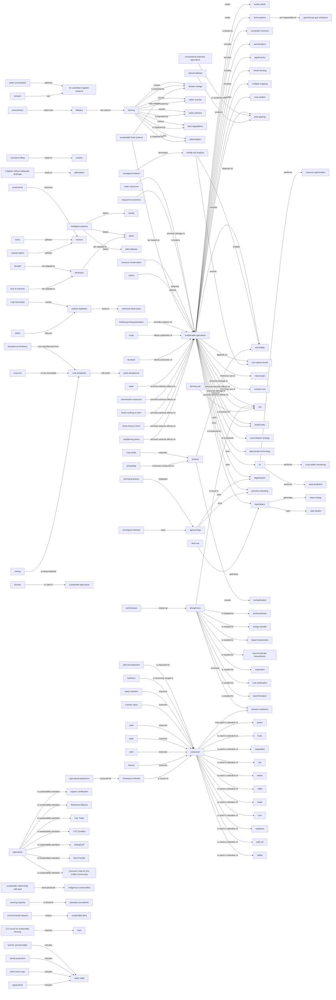

```mermaid
flowchart LR
    Sustainable_agriculture["Sustainable agriculture"] -->|meets| textile_needs["textile needs"]
    Sustainable_agriculture["Sustainable agriculture"] -->|meets| food_systems["food systems"]
    Sustainable_agriculture["Sustainable agriculture"] -->|is based on| ecosystem_services["ecosystem services"]
    Sustainable_agriculture["Sustainable agriculture"] -->|includes| permaculture["permaculture"]
    Sustainable_agriculture["Sustainable agriculture"] -->|includes| agroforestry["agroforestry"]
    Sustainable_agriculture["Sustainable agriculture"] -->|includes| mixed_farming["mixed farming"]
    Sustainable_agriculture["Sustainable agriculture"] -->|includes| multiple_cropping["multiple cropping"]
    Sustainable_agriculture["Sustainable agriculture"] -->|includes| crop_rotation["crop rotation"]
    Sustainable_agriculture["Sustainable agriculture"] -->|includes| land_sparing["land sparing"]
    Sustainable_agriculture["Sustainable agriculture"] -->|depends on| soil_fertility["soil fertility"]
    Sustainable_agriculture["Sustainable agriculture"] -->|depends on| soil_nutrient_levels["soil nutrient levels"]
    Sustainable_agriculture["Sustainable agriculture"] -->|minimizes use of| natural_gas["natural gas"]
    Sustainable_agriculture["Sustainable agriculture"] -->|minimizes use of| mineral_ores["mineral ores"]
    Sustainable_agriculture["Sustainable agriculture"] -->|prevents damage to| soil["soil"]
    Sustainable_agriculture["Sustainable agriculture"] -->|prevents damage to| biodiversity["biodiversity"]
    water_resources["water resources"] -->|prevents damage to| Sustainable_agriculture["Sustainable agriculture"]
    long_term_economics["long-term economics"] -->|considers| Sustainable_agriculture["Sustainable agriculture"]
    resource_conservation["resource conservation"] -->|balances| Sustainable_agriculture["Sustainable agriculture"]
    Sustainable_agriculture["Sustainable agriculture"] -->|is considered| reconciliation_ecology["reconciliation ecology"]
    Sustainable_agriculture["Sustainable agriculture"] -->|uses| appropriate_technology["appropriate technology"]
    Sustainable_agriculture["Sustainable agriculture"] -->|uses| AI["AI"]
    Sustainable_agriculture["Sustainable agriculture"] -->|uses| digitalization["digitalization"]
    Sustainable_agriculture["Sustainable agriculture"] -->|uses| precision_breeding["precision breeding"]
    Sustainable_agriculture["Sustainable agriculture"] -->|is enhanced by| Agrivoltaics["Agrivoltaics"]
    land_use["land use"] -->|optimizes| Agrivoltaics["Agrivoltaics"]
    Agrivoltaics["Agrivoltaics"] -->|generates| clean_energy["clean energy"]
    Agrivoltaics["Agrivoltaics"] -->|uses| solar_panels["solar panels"]
    farming["farming"] -->|causes| climate_change["climate change"]
    farming["farming"] -->|causes| water_scarcity["water scarcity"]
    farming["farming"] -->|causes| water_pollution["water pollution"]
    farming["farming"] -->|causes| land_degradation["land degradation"]
    farming["farming"] -->|causes| deforestation["deforestation"]
    farming["farming"] -->|is impacted by| climate_change["climate change"]
    farming["farming"] -->|is impacted by| water_scarcity["water scarcity"]
    farming["farming"] -->|is impacted by| water_pollution["water pollution"]
    farming["farming"] -->|is impacted by| land_degradation["land degradation"]
    farming["farming"] -->|is impacted by| deforestation["deforestation"]
    food_systems["food systems"] -->|are responsible for| greenhouse_gas_emissions["greenhouse gas emissions"]
    conventional_intensive_agriculture["conventional intensive agriculture"] -->|is combined with| land_sparing["land sparing"]
    natural_habitats["natural habitats"] -->|protects| land_sparing["land sparing"]
    AI["AI"] -->|performs| resource_optimization["resource optimization"]
    AI["AI"] -->|performs| crop_health_monitoring["crop health monitoring"]
    AI["AI"] -->|performs| yield_prediction["yield prediction"]
    water_consumption["water consumption"] -->|optimize| AI_controlled_irrigation_systems["AI-controlled irrigation systems"]
    sensors["sensors"] -->|use| AI_controlled_irrigation_systems["AI-controlled irrigation systems"]
    mobile_soil_analysis["mobile soil analysis"] -->|enables| soil_fertility["soil fertility"]
    ecological_footprint["ecological footprint"] -->|decreases| mobile_soil_analysis["mobile soil analysis"]
    mobile_soil_analysis["mobile soil analysis"] -->|permits| soil_nutrient_levels["soil nutrient levels"]
    Intelligent_systems["Intelligent systems"] -->|detect| weeds["weeds"]
    Intelligent_systems["Intelligent systems"] -->|detect| pests["pests"]
    Intelligent_systems["Intelligent systems"] -->|detect| plant_disease["plant disease"]
    farming_practices["farming practices"] -->|integrates| agroecology["agroecology"]
    ecological_methods["ecological methods"] -->|uses| agroecology["agroecology"]
    agroecology["agroecology"] -->|uses| digitalization["digitalization"]
    agroecology["agroecology"] -->|uses| precision_breeding["precision breeding"]
    excessive_tilling["excessive tilling"] -->|leads to| erosion["erosion"]
    irrigation_without_adequate_drainage["irrigation without adequate drainage"] -->|leads to| salinization["salinization"]
    crop_harvesting["crop harvesting"] -->|causes| nutrient_depletion["nutrient depletion"]
    yields["yields"] -->|reduces| nutrient_depletion["nutrient depletion"]
    nutrient_depletion["nutrient depletion"] -->|leads to| rainforest_destruction["rainforest destruction"]
    fertilizer["fertilizer"] -->|improves| soil_fertility["soil fertility"]
    crop_yields["crop yields"] -->|improves| fertilizer["fertilizer"]
    fertilizer["fertilizer"] -->|causes| eutrophication["eutrophication"]
    productivity["productivity"] -->|improves| manure["manure"]
    rivers["rivers"] -->|pollutes| manure["manure"]
    coastal_waters["coastal waters"] -->|pollutes| manure["manure"]
    Nitrates["Nitrates"] -->|are used in| farming["farming"]
    environment["environment"] -->|leach into| Nitrates["Nitrates"]
    phosphorus["phosphorus"] -->|is needed for| photosynthesis["photosynthesis"]
    phosphorus["phosphorus"] -->|is needed for| energy_transfer["energy transfer"]
    phosphorus["phosphorus"] -->|is needed for| signal_transduction["signal transduction"]
    phosphorus["phosphorus"] -->|is needed for| macromolecular_biosynthesis["macromolecular biosynthesis"]
    phosphorus["phosphorus"] -->|is needed for| respiration["respiration"]
    phosphorus["phosphorus"] -->|is needed for| root_ramification["root ramification"]
    phosphorus["phosphorus"] -->|is needed for| seed_formation["seed formation"]
    phosphorus["phosphorus"] -->|increases| disease_resistance["disease resistance"]
    phosphorus["phosphorus"] -->|is found in| soil["soil"]
    soil_biomass["soil biomass"] -->|makes up| phosphorus["phosphorus"]
    phosphate["phosphate"] -->|is primary component in| fertilizer["fertilizer"]
    phosphorus_fertilizers["phosphorus fertilizers"] -->|are manufactured from| rock_phosphate["rock phosphate"]
    resource["resource"] -->|is non-renewable| rock_phosphate["rock phosphate"]
    mining["mining"] -->|is being depleted| rock_phosphate["rock phosphate"]
    rock_phosphate["rock phosphate"] -->|will reach| peak_phosphorus["peak phosphorus"]
    plant_development["plant development"] -->|is important for| potassium["potassium"]
    fertilizers["fertilizers"] -->|is commonly sought in| potassium["potassium"]
    water_retention["water retention"] -->|improves| potassium["potassium"]
    nutrient_value["nutrient value"] -->|improves| potassium["potassium"]
    yield["yield"] -->|improves| potassium["potassium"]
    taste["taste"] -->|improves| potassium["potassium"]
    color["color"] -->|improves| potassium["potassium"]
    texture["texture"] -->|improves| potassium["potassium"]
    potassium["potassium"] -->|improves| disease_resistance["disease resistance"]
    potassium["potassium"] -->|is used in cultivation of| grains["grains"]
    potassium["potassium"] -->|is used in cultivation of| fruits["fruits"]
    potassium["potassium"] -->|is used in cultivation of| vegetables["vegetables"]
    potassium["potassium"] -->|is used in cultivation of| rice["rice"]
    potassium["potassium"] -->|is used in cultivation of| wheat["wheat"]
    potassium["potassium"] -->|is used in cultivation of| millet["millet"]
    potassium["potassium"] -->|is used in cultivation of| sugar["sugar"]
    potassium["potassium"] -->|is used in cultivation of| corn["corn"]
    potassium["potassium"] -->|is used in cultivation of| soybeans["soybeans"]
    potassium["potassium"] -->|is used in cultivation of| palm_oil["palm oil"]
    potassium["potassium"] -->|is used in cultivation of| coffee["coffee"]
    Potassium_chloride["Potassium chloride"] -->|is source of| potassium["potassium"]
    agricultural_potassium["agricultural potassium"] -->|accounts for| Potassium_chloride["Potassium chloride"]
    biochar["biochar"] -->|is used in| sustainable_agriculture["sustainable agriculture"]
    landraces["landraces"] -->|are adapted to| pests["pests"]
    drought["drought"] -->|are adapted to| landraces["landraces"]
    lack_of_nutrients["lack of nutrients"] -->|are adapted to| landraces["landraces"]
    agriculture["agriculture"] -->|is sustainability standard| organic_certification["organic certification"]
    agriculture["agriculture"] -->|is sustainability standard| Rainforest_Alliance["Rainforest Alliance"]
    agriculture["agriculture"] -->|is sustainability standard| Fair_Trade["Fair Trade"]
    agriculture["agriculture"] -->|is sustainability standard| UTZ_Certified["UTZ Certified"]
    agriculture["agriculture"] -->|is sustainability standard| GlobalGAP["GlobalGAP"]
    agriculture["agriculture"] -->|is sustainability standard| Bird_Friendly["Bird Friendly"]
    agriculture["agriculture"] -->|is sustainability standard| Common_Code_for_the_Coffee_Community["Common Code for the Coffee Community"]
    USDA["USDA"] -->|defined| Sustainable_agriculture["Sustainable agriculture"]
    sustainable_relationship_with_land["sustainable relationship with land"] -->|have practiced| indigenous_communities["indigenous communities"]
    carrying_capacity["carrying capacity"] -->|is linked to| planetary_boundaries["planetary boundaries"]
    environmental_impacts["environmental impacts"] -->|reduce| sustainable_diets["sustainable diets"]
    sustainable_food_systems["sustainable food systems"] -->|are based on| Sustainable_agriculture["Sustainable agriculture"]
    sustainable_food_systems["sustainable food systems"] -->|help mitigate| climate_change["climate change"]
    feeding_growing_population["feeding growing population"] -->|provides solution for| Sustainable_agriculture["Sustainable agriculture"]
    crops["crops"] -->|allows production of| Sustainable_agriculture["Sustainable agriculture"]
    livestock["livestock"] -->|allows production of| Sustainable_agriculture["Sustainable agriculture"]
    Sustainable_agriculture["Sustainable agriculture"] -->|prevents adverse effects on| soil["soil"]
    water["water"] -->|prevents adverse effects on| Sustainable_agriculture["Sustainable agriculture"]
    Sustainable_agriculture["Sustainable agriculture"] -->|prevents adverse effects on| biodiversity["biodiversity"]
    downstream_resources["downstream resources"] -->|prevents adverse effects on| Sustainable_agriculture["Sustainable agriculture"]
    those_working_on_farm["those working on farm"] -->|prevents adverse effects on| Sustainable_agriculture["Sustainable agriculture"]
    those_living_on_farm["those living on farm"] -->|prevents adverse effects on| Sustainable_agriculture["Sustainable agriculture"]
    neighboring_areas["neighboring areas"] -->|prevents adverse effects on| Sustainable_agriculture["Sustainable agriculture"]
    farming_site["farming site"] -->|is important for| soil["soil"]
    12.5_acres_for_sustainable_farming["12.5 acres for sustainable farming"] -->|requires| Asia["Asia"]
    land_for_animal_fodder["land for animal fodder"] -->|includes| AARI_1996["AARI-1996"]
    cereal_production["cereal production"] -->|includes| AARI_1996["AARI-1996"]
    other_food_crops["other food crops"] -->|includes| AARI_1996["AARI-1996"]
    aquaculture["aquaculture"] -->|includes| AARI_1996["AARI-1996"]
```