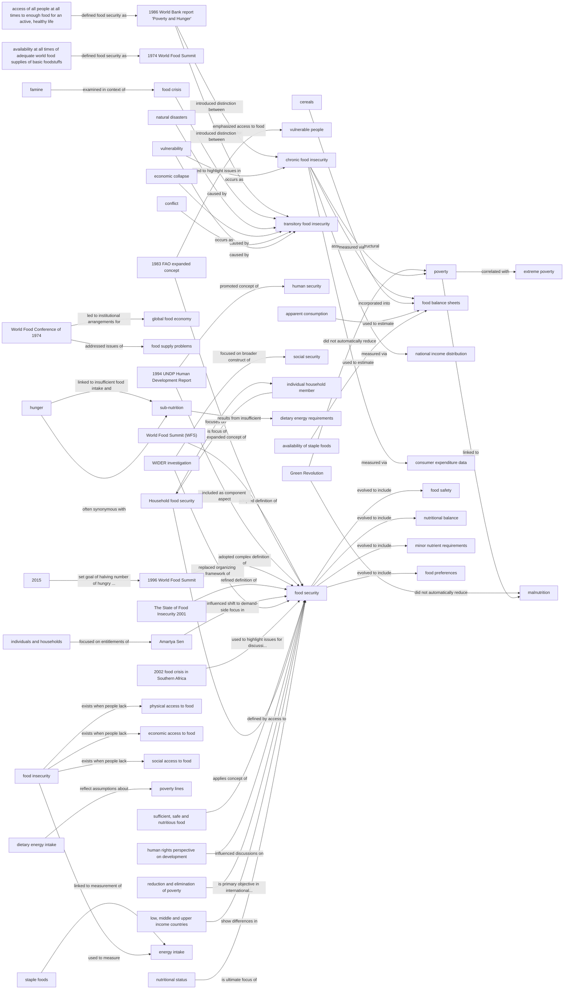

```mermaid
flowchart LR
    World_Food_Summit_WFS["World Food Summit (WFS)"] -->|adopted definition of| food_security["food security"]
    availability_at_all_times_of_adequate_world_food_supplies_of_basic_foodstuffs["availability at all times of adequate world food supplies of basic foodstuffs"] -->|defined food security as| 1974_World_Food_Summit["1974 World Food Summit"]
    1983_FAO_expanded_concept["1983 FAO expanded concept"] -->|expanded concept of| food_security["food security"]
    1983_FAO_expanded_concept["1983 FAO expanded concept"] -->|emphasized access to food for| vulnerable_people["vulnerable people"]
    1986_World_Bank_report_'Poverty_and_Hunger'["1986 World Bank report 'Poverty and Hunger'"] -->|introduced distinction between| chronic_food_insecurity["chronic food insecurity"]
    1986_World_Bank_report_'Poverty_and_Hunger'["1986 World Bank report 'Poverty and Hunger'"] -->|introduced distinction between| transitory_food_insecurity["transitory food insecurity"]
    access_of_all_people_at_all_times_to_enough_food_for_an_active,_healthy_life["access of all people at all times to enough food for an active, healthy life"] -->|defined food security as| 1986_World_Bank_report_'Poverty_and_Hunger'["1986 World Bank report 'Poverty and Hunger'"]
    1994_UNDP_Human_Development_Report["1994 UNDP Human Development Report"] -->|promoted concept of| human_security["human security"]
    1994_UNDP_Human_Development_Report["1994 UNDP Human Development Report"] -->|included as component aspect| food_security["food security"]
    1996_World_Food_Summit["1996 World Food Summit"] -->|adopted complex definition of| food_security["food security"]
    2015["2015"] -->|set goal of halving number of hungry ...| 1996_World_Food_Summit["1996 World Food Summit"]
    The_State_of_Food_Insecurity_2001["The State of Food Insecurity 2001"] -->|refined definition of| food_security["food security"]
    individuals_and_households["individuals and households"] -->|focused on entitlements of| Amartya_Sen["Amartya Sen"]
    Amartya_Sen["Amartya Sen"] -->|influenced shift to demand-side focus in| food_security["food security"]
    Green_Revolution["Green Revolution"] -->|did not automatically reduce| poverty["poverty"]
    Green_Revolution["Green Revolution"] -->|did not automatically reduce| malnutrition["malnutrition"]
    World_Food_Conference_of_1974["World Food Conference of 1974"] -->|led to institutional arrangements for| global_food_economy["global food economy"]
    World_Food_Conference_of_1974["World Food Conference of 1974"] -->|addressed issues of| food_supply_problems["food supply problems"]
    WIDER_investigation["WIDER investigation"] -->|focused on broader construct of| social_security["social security"]
    WIDER_investigation["WIDER investigation"] -->|replaced organizing framework of| food_security["food security"]
    famine["famine"] -->|examined in context of| food_crisis["food crisis"]
    hunger["hunger"] -->|linked to insufficient food intake and| sub_nutrition["sub-nutrition"]
    food_crisis["food crisis"] -->|used to highlight issues in| transitory_food_insecurity["transitory food insecurity"]
    2002_food_crisis_in_Southern_Africa["2002 food crisis in Southern Africa"] -->|used to highlight issues for discussi...| food_security["food security"]
    chronic_food_insecurity["chronic food insecurity"] -->|associated with structural| poverty["poverty"]
    chronic_food_insecurity["chronic food insecurity"] -->|measured via| food_balance_sheets["food balance sheets"]
    chronic_food_insecurity["chronic food insecurity"] -->|measured via| national_income_distribution["national income distribution"]
    chronic_food_insecurity["chronic food insecurity"] -->|measured via| consumer_expenditure_data["consumer expenditure data"]
    natural_disasters["natural disasters"] -->|caused by| transitory_food_insecurity["transitory food insecurity"]
    economic_collapse["economic collapse"] -->|caused by| transitory_food_insecurity["transitory food insecurity"]
    conflict["conflict"] -->|caused by| transitory_food_insecurity["transitory food insecurity"]
    food_security["food security"] -->|evolved to include| food_safety["food safety"]
    food_security["food security"] -->|evolved to include| nutritional_balance["nutritional balance"]
    food_security["food security"] -->|evolved to include| minor_nutrient_requirements["minor nutrient requirements"]
    food_security["food security"] -->|evolved to include| food_preferences["food preferences"]
    sufficient,_safe_and_nutritious_food["sufficient, safe and nutritious food"] -->|defined by access to| food_security["food security"]
    Household_food_security["Household food security"] -->|applies concept of| food_security["food security"]
    Household_food_security["Household food security"] -->|focuses on| individual_household_member["individual household member"]
    food_insecurity["food insecurity"] -->|exists when people lack| physical_access_to_food["physical access to food"]
    food_insecurity["food insecurity"] -->|exists when people lack| economic_access_to_food["economic access to food"]
    food_insecurity["food insecurity"] -->|exists when people lack| social_access_to_food["social access to food"]
    sub_nutrition["sub-nutrition"] -->|results from insufficient| dietary_energy_requirements["dietary energy requirements"]
    hunger["hunger"] -->|often synonymous with| sub_nutrition["sub-nutrition"]
    dietary_energy_intake["dietary energy intake"] -->|reflect assumptions about| poverty_lines["poverty lines"]
    poverty["poverty"] -->|correlated with| extreme_poverty["extreme poverty"]
    poverty["poverty"] -->|linked to| malnutrition["malnutrition"]
    vulnerability["vulnerability"] -->|occurs as| chronic_food_insecurity["chronic food insecurity"]
    vulnerability["vulnerability"] -->|occurs as| transitory_food_insecurity["transitory food insecurity"]
    human_rights_perspective_on_development["human rights perspective on development"] -->|influenced discussions on| food_security["food security"]
    reduction_and_elimination_of_poverty["reduction and elimination of poverty"] -->|is primary objective in international...| food_security["food security"]
    low,_middle_and_upper_income_countries["low, middle and upper income countries"] -->|show differences in| food_security["food security"]
    cereals["cereals"] -->|incorporated into| food_balance_sheets["food balance sheets"]
    apparent_consumption["apparent consumption"] -->|used to estimate| food_balance_sheets["food balance sheets"]
    availability_of_staple_foods["availability of staple foods"] -->|used to estimate| food_balance_sheets["food balance sheets"]
    staple_foods["staple foods"] -->|linked to measurement of| energy_intake["energy intake"]
    food_insecurity["food insecurity"] -->|used to measure| energy_intake["energy intake"]
    nutritional_status["nutritional status"] -->|is ultimate focus of| food_security["food security"]
    individual_household_member["individual household member"] -->|is focus of| Household_food_security["Household food security"]
```