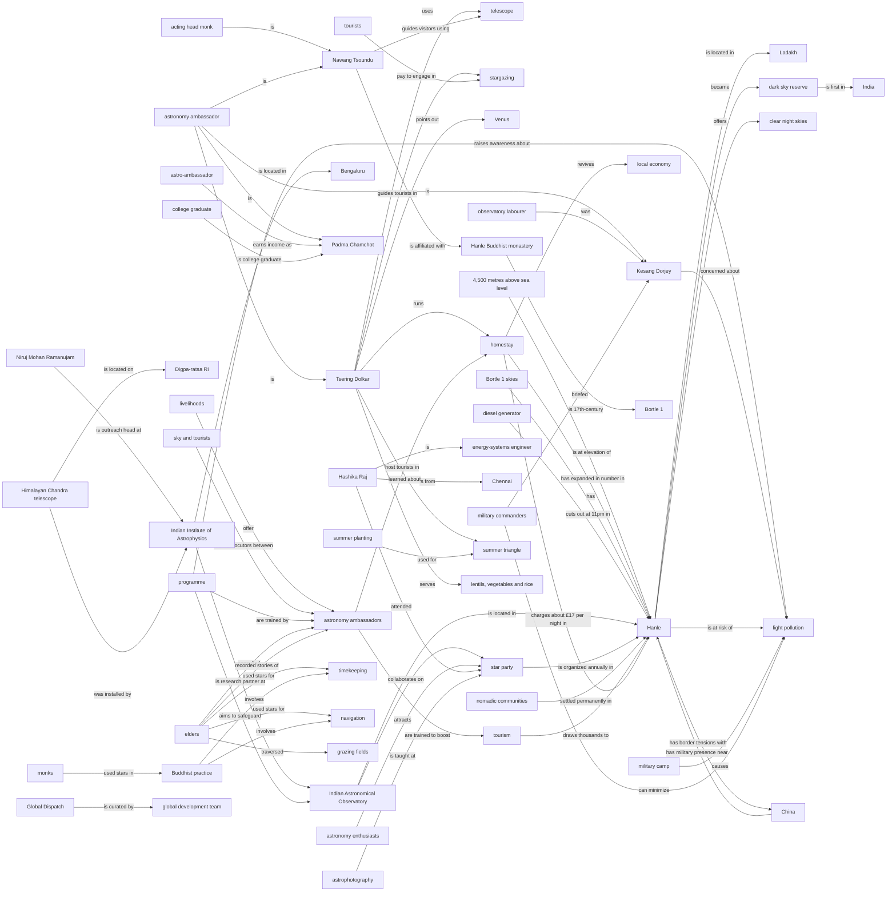

```mermaid
flowchart LR
    Hanle["Hanle"] -->|is located in| Ladakh["Ladakh"]
    Hanle["Hanle"] -->|became| dark_sky_reserve["dark sky reserve"]
    dark_sky_reserve["dark sky reserve"] -->|is first in| India["India"]
    astronomy_ambassador["astronomy ambassador"] -->|is| Tsering_Dolkar["Tsering Dolkar"]
    Tsering_Dolkar["Tsering Dolkar"] -->|uses| telescope["telescope"]
    Tsering_Dolkar["Tsering Dolkar"] -->|guides tourists in| stargazing["stargazing"]
    Tsering_Dolkar["Tsering Dolkar"] -->|points out| Venus["Venus"]
    Tsering_Dolkar["Tsering Dolkar"] -->|runs| homestay["homestay"]
    astronomy_ambassadors["astronomy ambassadors"] -->|are trained to boost| tourism["tourism"]
    livelihoods["livelihoods"] -->|offer| astronomy_ambassadors["astronomy ambassadors"]
    sky_and_tourists["sky and tourists"] -->|are interlocutors between| astronomy_ambassadors["astronomy ambassadors"]
    Indian_Institute_of_Astrophysics["Indian Institute of Astrophysics"] -->|is research partner at| Indian_Astronomical_Observatory["Indian Astronomical Observatory"]
    Niruj_Mohan_Ramanujam["Niruj Mohan Ramanujam"] -->|is outreach head at| Indian_Institute_of_Astrophysics["Indian Institute of Astrophysics"]
    Indian_Institute_of_Astrophysics["Indian Institute of Astrophysics"] -->|is located in| Bengaluru["Bengaluru"]
    Himalayan_Chandra_telescope["Himalayan Chandra telescope"] -->|was installed by| Indian_Institute_of_Astrophysics["Indian Institute of Astrophysics"]
    Himalayan_Chandra_telescope["Himalayan Chandra telescope"] -->|is located on| Digpa_ratsa_Ri["Digpa-ratsa Ri"]
    Hanle["Hanle"] -->|offers| clear_night_skies["clear night skies"]
    4,500_metres_above_sea_level["4,500 metres above sea level"] -->|is at elevation of| Hanle["Hanle"]
    programme["programme"] -->|are trained by| astronomy_ambassadors["astronomy ambassadors"]
    programme["programme"] -->|aims to safeguard| Indian_Astronomical_Observatory["Indian Astronomical Observatory"]
    programme["programme"] -->|raises awareness about| light_pollution["light pollution"]
    tourists["tourists"] -->|pay to engage in| stargazing["stargazing"]
    astronomy_ambassadors["astronomy ambassadors"] -->|host tourists in| homestay["homestay"]
    homestay["homestay"] -->|has expanded in number in| Hanle["Hanle"]
    homestay["homestay"] -->|revives| local_economy["local economy"]
    astronomy_ambassador["astronomy ambassador"] -->|is| Padma_Chamchot["Padma Chamchot"]
    astro_ambassador["astro-ambassador"] -->|earns income as| Padma_Chamchot["Padma Chamchot"]
    college_graduate["college graduate"] -->|is college graduate| Padma_Chamchot["Padma Chamchot"]
    astronomy_ambassador["astronomy ambassador"] -->|is| Kesang_Dorjey["Kesang Dorjey"]
    observatory_labourer["observatory labourer"] -->|was| Kesang_Dorjey["Kesang Dorjey"]
    Kesang_Dorjey["Kesang Dorjey"] -->|concerned about| light_pollution["light pollution"]
    acting_head_monk["acting head monk"] -->|is| Nawang_Tsoundu["Nawang Tsoundu"]
    Nawang_Tsoundu["Nawang Tsoundu"] -->|is affiliated with| Hanle_Buddhist_monastery["Hanle Buddhist monastery"]
    astronomy_ambassador["astronomy ambassador"] -->|is| Nawang_Tsoundu["Nawang Tsoundu"]
    Nawang_Tsoundu["Nawang Tsoundu"] -->|guides visitors using| telescope["telescope"]
    Hanle_Buddhist_monastery["Hanle Buddhist monastery"] -->|is 17th-century| Bortle_1["Bortle 1"]
    Bortle_1_skies["Bortle 1 skies"] -->|has| Hanle["Hanle"]
    Hanle["Hanle"] -->|is at risk of| light_pollution["light pollution"]
    military_camp["military camp"] -->|causes| light_pollution["light pollution"]
    diesel_generator["diesel generator"] -->|cuts out at 11pm in| Hanle["Hanle"]
    Indian_Astronomical_Observatory["Indian Astronomical Observatory"] -->|is located in| Hanle["Hanle"]
    Indian_Astronomical_Observatory["Indian Astronomical Observatory"] -->|collaborates on| star_party["star party"]
    star_party["star party"] -->|is organized annually in| Hanle["Hanle"]
    astronomy_enthusiasts["astronomy enthusiasts"] -->|attracts| star_party["star party"]
    Hashika_Raj["Hashika Raj"] -->|attended| star_party["star party"]
    Hashika_Raj["Hashika Raj"] -->|is| energy_systems_engineer["energy-systems engineer"]
    Hashika_Raj["Hashika Raj"] -->|is from| Chennai["Chennai"]
    astrophotography["astrophotography"] -->|is taught at| star_party["star party"]
    elders["elders"] -->|consulted| astronomy_ambassadors["astronomy ambassadors"]
    elders["elders"] -->|used stars for| timekeeping["timekeeping"]
    elders["elders"] -->|used stars for| navigation["navigation"]
    elders["elders"] -->|traversed| grazing_fields["grazing fields"]
    nomadic_communities["nomadic communities"] -->|settled permanently in| Hanle["Hanle"]
    elders["elders"] -->|recorded stories of| astronomy_ambassadors["astronomy ambassadors"]
    Tsering_Dolkar["Tsering Dolkar"] -->|learned about| summer_triangle["summer triangle"]
    summer_planting["summer planting"] -->|used for| summer_triangle["summer triangle"]
    monks["monks"] -->|used stars in| Buddhist_practice["Buddhist practice"]
    Buddhist_practice["Buddhist practice"] -->|involves| timekeeping["timekeeping"]
    Buddhist_practice["Buddhist practice"] -->|involves| navigation["navigation"]
    Hanle["Hanle"] -->|has border tensions with| China["China"]
    China["China"] -->|has military presence near| Hanle["Hanle"]
    tourism["tourism"] -->|draws thousands to| Hanle["Hanle"]
    homestay["homestay"] -->|charges about £17 per night in| Hanle["Hanle"]
    Tsering_Dolkar["Tsering Dolkar"] -->|serves| lentils,_vegetables_and_rice["lentils, vegetables and rice"]
    military_commanders["military commanders"] -->|briefed| Kesang_Dorjey["Kesang Dorjey"]
    military_commanders["military commanders"] -->|can minimize| light_pollution["light pollution"]
    Global_Dispatch["Global Dispatch"] -->|is curated by| global_development_team["global development team"]
```