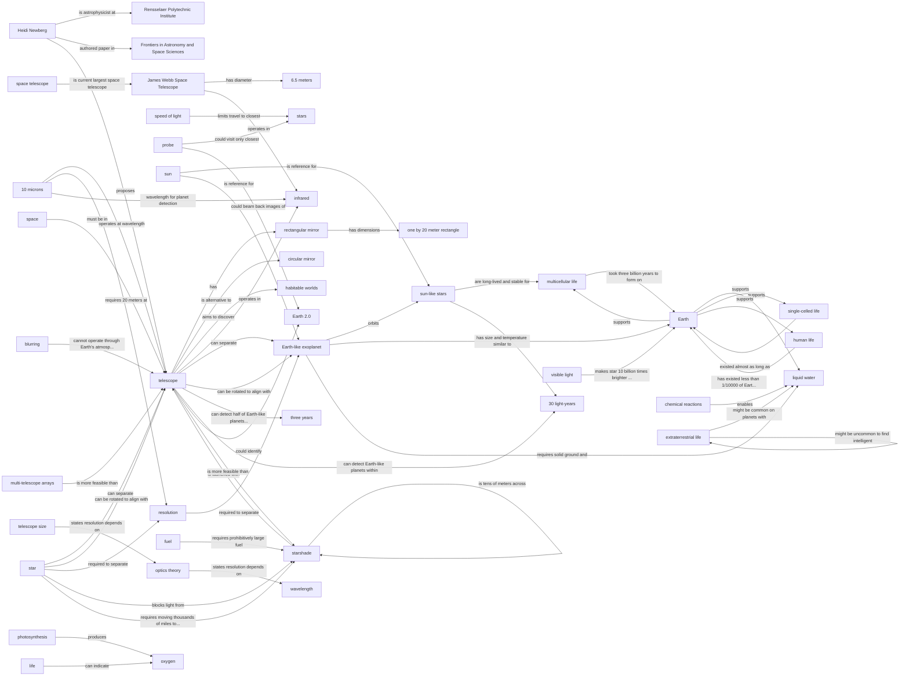

```mermaid
flowchart LR
    Heidi_Newberg["Heidi Newberg"] -->|is astrophysicist at| Rensselaer_Polytechnic_Institute["Rensselaer Polytechnic Institute"]
    Heidi_Newberg["Heidi Newberg"] -->|authored paper in| Frontiers_in_Astronomy_and_Space_Sciences["Frontiers in Astronomy and Space Sciences"]
    Heidi_Newberg["Heidi Newberg"] -->|proposes| telescope["telescope"]
    telescope["telescope"] -->|has| rectangular_mirror["rectangular mirror"]
    telescope["telescope"] -->|is alternative to| circular_mirror["circular mirror"]
    telescope["telescope"] -->|aims to discover| habitable_worlds["habitable worlds"]
    rectangular_mirror["rectangular mirror"] -->|has dimensions| one_by_20_meter_rectangle["one by 20 meter rectangle"]
    10_microns["10 microns"] -->|operates at wavelength| telescope["telescope"]
    telescope["telescope"] -->|operates in| infrared["infrared"]
    telescope["telescope"] -->|can separate| Earth_like_exoplanet["Earth-like exoplanet"]
    star["star"] -->|can separate| telescope["telescope"]
    star["star"] -->|can be rotated to align with| telescope["telescope"]
    telescope["telescope"] -->|can be rotated to align with| Earth_like_exoplanet["Earth-like exoplanet"]
    telescope["telescope"] -->|can detect half of Earth-like planets...| three_years["three years"]
    telescope["telescope"] -->|can detect Earth-like planets within| 30_light_years["30 light-years"]
    Earth_like_exoplanet["Earth-like exoplanet"] -->|orbits| sun_like_stars["sun-like stars"]
    sun_like_stars["sun-like stars"] -->|are long-lived and stable for| multicellular_life["multicellular life"]
    sun_like_stars["sun-like stars"] -->|are closer than| 30_light_years["30 light-years"]
    Earth["Earth"] -->|supports| liquid_water["liquid water"]
    Earth["Earth"] -->|supports| single_celled_life["single-celled life"]
    Earth["Earth"] -->|supports| multicellular_life["multicellular life"]
    Earth["Earth"] -->|supports| human_life["human life"]
    chemical_reactions["chemical reactions"] -->|enables| liquid_water["liquid water"]
    single_celled_life["single-celled life"] -->|existed almost as long as| Earth["Earth"]
    multicellular_life["multicellular life"] -->|took three billion years to form on| Earth["Earth"]
    human_life["human life"] -->|has existed less than 1/10000 of Eart...| Earth["Earth"]
    extraterrestrial_life["extraterrestrial life"] -->|might be common on planets with| liquid_water["liquid water"]
    extraterrestrial_life["extraterrestrial life"] -->|might be uncommon to find intelligent| extraterrestrial_life["extraterrestrial life"]
    speed_of_light["speed of light"] -->|limits travel to closest| stars["stars"]
    probe["probe"] -->|could visit only closest| stars["stars"]
    sun["sun"] -->|is reference for| sun_like_stars["sun-like stars"]
    sun["sun"] -->|is reference for| Earth_like_exoplanet["Earth-like exoplanet"]
    Earth_like_exoplanet["Earth-like exoplanet"] -->|has size and temperature similar to| Earth["Earth"]
    Earth_like_exoplanet["Earth-like exoplanet"] -->|requires solid ground and| liquid_water["liquid water"]
    telescope_size["telescope size"] -->|states resolution depends on| optics_theory["optics theory"]
    optics_theory["optics theory"] -->|states resolution depends on| wavelength["wavelength"]
    10_microns["10 microns"] -->|requires 20 meters at| resolution["resolution"]
    star["star"] -->|required to separate| resolution["resolution"]
    resolution["resolution"] -->|required to separate| Earth_like_exoplanet["Earth-like exoplanet"]
    James_Webb_Space_Telescope["James Webb Space Telescope"] -->|has diameter| 6.5_meters["6.5 meters"]
    space_telescope["space telescope"] -->|is current largest space telescope| James_Webb_Space_Telescope["James Webb Space Telescope"]
    James_Webb_Space_Telescope["James Webb Space Telescope"] -->|operates in| infrared["infrared"]
    star["star"] -->|blocks light from| starshade["starshade"]
    starshade["starshade"] -->|is tens of meters across| starshade["starshade"]
    starshade["starshade"] -->|is launched with| telescope["telescope"]
    star["star"] -->|requires moving thousands of miles to...| starshade["starshade"]
    fuel["fuel"] -->|requires prohibitively large fuel| starshade["starshade"]
    space["space"] -->|must be in| telescope["telescope"]
    blurring["blurring"] -->|cannot operate through Earth's atmosp...| telescope["telescope"]
    visible_light["visible light"] -->|makes star 10 billion times brighter ...| Earth["Earth"]
    10_microns["10 microns"] -->|wavelength for planet detection| infrared["infrared"]
    photosynthesis["photosynthesis"] -->|produces| oxygen["oxygen"]
    life["life"] -->|can indicate| oxygen["oxygen"]
    probe["probe"] -->|could beam back images of| Earth_2.0["Earth 2.0"]
    telescope["telescope"] -->|could identify| Earth_2.0["Earth 2.0"]
    telescope["telescope"] -->|is more feasible than| starshade["starshade"]
    multi_telescope_arrays["multi-telescope arrays"] -->|is more feasible than| telescope["telescope"]
```