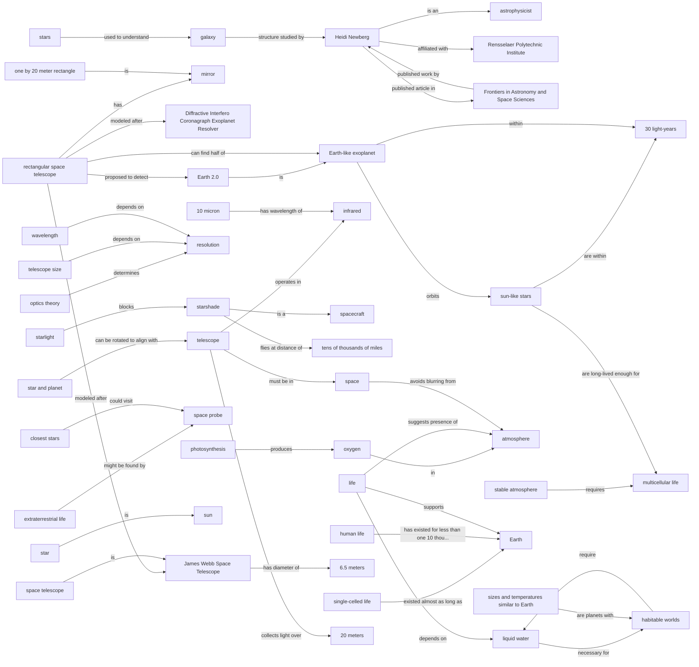

```mermaid
flowchart LR
    Heidi_Newberg["Heidi Newberg"] -->|is an| astrophysicist["astrophysicist"]
    Heidi_Newberg["Heidi Newberg"] -->|affiliated with| Rensselaer_Polytechnic_Institute["Rensselaer Polytechnic Institute"]
    Heidi_Newberg["Heidi Newberg"] -->|published article in| Frontiers_in_Astronomy_and_Space_Sciences["Frontiers in Astronomy and Space Sciences"]
    rectangular_space_telescope["rectangular space telescope"] -->|proposed to detect| Earth_2.0["Earth 2.0"]
    rectangular_space_telescope["rectangular space telescope"] -->|has| mirror["mirror"]
    one_by_20_meter_rectangle["one by 20 meter rectangle"] -->|is| mirror["mirror"]
    rectangular_space_telescope["rectangular space telescope"] -->|modeled after| Diffractive_Interfero_Coronagraph_Exoplanet_Resolver["Diffractive Interfero Coronagraph Exoplanet Resolver"]
    rectangular_space_telescope["rectangular space telescope"] -->|modeled after| James_Webb_Space_Telescope["James Webb Space Telescope"]
    Earth_2.0["Earth 2.0"] -->|is| Earth_like_exoplanet["Earth-like exoplanet"]
    Earth_like_exoplanet["Earth-like exoplanet"] -->|orbits| sun_like_stars["sun-like stars"]
    sun_like_stars["sun-like stars"] -->|are within| 30_light_years["30 light-years"]
    liquid_water["liquid water"] -->|necessary for| habitable_worlds["habitable worlds"]
    habitable_worlds["habitable worlds"] -->|require| liquid_water["liquid water"]
    telescope["telescope"] -->|operates in| infrared["infrared"]
    10_micron["10 micron"] -->|has wavelength of| infrared["infrared"]
    optics_theory["optics theory"] -->|determines| resolution["resolution"]
    telescope_size["telescope size"] -->|depends on| resolution["resolution"]
    wavelength["wavelength"] -->|depends on| resolution["resolution"]
    starshade["starshade"] -->|is a| spacecraft["spacecraft"]
    starlight["starlight"] -->|blocks| starshade["starshade"]
    starshade["starshade"] -->|flies at distance of| tens_of_thousands_of_miles["tens of thousands of miles"]
    photosynthesis["photosynthesis"] -->|produces| oxygen["oxygen"]
    oxygen["oxygen"] -->|in| atmosphere["atmosphere"]
    life["life"] -->|suggests presence of| atmosphere["atmosphere"]
    stable_atmosphere["stable atmosphere"] -->|requires| multicellular_life["multicellular life"]
    single_celled_life["single-celled life"] -->|existed almost as long as| Earth["Earth"]
    human_life["human life"] -->|has existed for less than one 10 thou...| Earth["Earth"]
    extraterrestrial_life["extraterrestrial life"] -->|might be found by| space_probe["space probe"]
    closest_stars["closest stars"] -->|could visit| space_probe["space probe"]
    James_Webb_Space_Telescope["James Webb Space Telescope"] -->|has diameter of| 6.5_meters["6.5 meters"]
    space_telescope["space telescope"] -->|is| James_Webb_Space_Telescope["James Webb Space Telescope"]
    telescope["telescope"] -->|must be in| space["space"]
    space["space"] -->|avoids blurring from| atmosphere["atmosphere"]
    telescope["telescope"] -->|collects light over| 20_meters["20 meters"]
    star_and_planet["star and planet"] -->|can be rotated to align with| telescope["telescope"]
    rectangular_space_telescope["rectangular space telescope"] -->|can find half of| Earth_like_exoplanet["Earth-like exoplanet"]
    Earth_like_exoplanet["Earth-like exoplanet"] -->|within| 30_light_years["30 light-years"]
    Frontiers_in_Astronomy_and_Space_Sciences["Frontiers in Astronomy and Space Sciences"] -->|published work by| Heidi_Newberg["Heidi Newberg"]
    galaxy["galaxy"] -->|structure studied by| Heidi_Newberg["Heidi Newberg"]
    stars["stars"] -->|used to understand| galaxy["galaxy"]
    star["star"] -->|is| sun["sun"]
    sun_like_stars["sun-like stars"] -->|are long-lived enough for| multicellular_life["multicellular life"]
    sizes_and_temperatures_similar_to_Earth["sizes and temperatures similar to Earth"] -->|are planets with| habitable_worlds["habitable worlds"]
    life["life"] -->|supports| Earth["Earth"]
    life["life"] -->|depends on| liquid_water["liquid water"]
```
