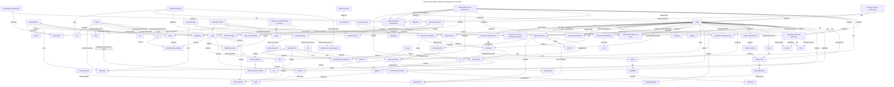

```mermaid
---
title: astro-ambassadors-stargazers-himalayas-hanle-ladak
---
graph TD
    indian_astronomical_observatory["Indian Astronomical Observatory"] -- located in --> hanle["Hanle"]
    hanle["Hanle"] -- located in --> ladakh["Ladakh"]
    hanle["Hanle"] -- is a --> dark_sky_reserve["dark sky reserve"]
    hanle["Hanle"] -- has elevation --> n_4_500_metres_above_sea_level["4,500 metres above sea level"]
    hanle["Hanle"] -- has --> astronomy_ambassadors["astronomy ambassadors"]
    hanle["Hanle"] -- has tourism initiative --> astro_tourism_initiative["astro-tourism initiative"]
    tsering_dolkar["Tsering Dolkar"] -- works as --> interlocutors["interlocutors"]
    tsering_dolkar["Tsering Dolkar"] -- guides --> stargazing["stargazing"]
    tsering_dolkar["Tsering Dolkar"] -- points to --> venus["Venus"]
    astro_tourists["astro-tourists"] -- visit --> indian_astronomical_observatory["Indian Astronomical Observatory"]
    indian_astronomical_observatory["Indian Astronomical Observatory"] -- attracts --> astro_tourists["astro-tourists"]
    indian_astronomical_observatory["Indian Astronomical Observatory"] -- research partner --> indian_institute_of_astrophysics["Indian Institute of Astrophysics"]
    indian_institute_of_astrophysics["Indian Institute of Astrophysics"] -- located in --> bengaluru["Bengaluru"]
    niruj_mohan_ramanujam["Niruj Mohan Ramanujam"] -- works at --> indian_institute_of_astrophysics["Indian Institute of Astrophysics"]
    niruj_mohan_ramanujam["Niruj Mohan Ramanujam"] -- describes --> interlocutors["interlocutors"]
    astronomy_ambassadors["astronomy ambassadors"] -- host --> homestays["homestays"]
    tourism_initiative["tourism initiative"] -- aims to reduce --> light_pollution["light pollution"]
    hanle["Hanle"] -- became --> dark_sky_reserve["dark sky reserve"]
    dolkar["Dolkar"] -- is among --> n_25["25"]
    hanle["Hanle"] -- has --> himalayan_chandra_telescope["Himalayan Chandra telescope"]
    himalayan_chandra_telescope["Himalayan Chandra telescope"] -- has diameter --> n_2_metre["2-metre"]
    himalayan_chandra_telescope["Himalayan Chandra telescope"] -- installed in --> n_2000["2000"]
    hanle["Hanle"] -- located near --> digpa_ratsa_ri["Digpa-ratsa Ri"]
    hanle["Hanle"] -- aspires to be --> world_class_astronomy_hub["world-class astronomy hub"]
    hanle["Hanle"] -- has --> homestays["homestays"]
    homestays["homestays"] -- host --> tourists["tourists"]
    astro_ambassadors["astro-ambassadors"] -- offer --> stargazing["stargazing"]
    astro_ambassadors["astro-ambassadors"] -- offer --> deep_sky_exploration["deep-sky exploration"]
    astro_ambassadors["astro-ambassadors"] -- include --> college_graduate["college graduate"]
    college_graduate["college graduate"] -- chose not to take --> government_job["government job"]
    college_graduate["college graduate"] -- chose not to move to --> city["city"]
    college_graduate["college graduate"] -- chose not to work as --> assistant_at_a_travel_agency["assistant at a travel agency"]
    hanle["Hanle"] -- has annual hiatus of --> annual_five_month_hiatus["annual five-month hiatus"]
    annual_five_month_hiatus["annual five-month hiatus"] -- caused by --> snow["snow"]
    kesang_dorjey["Kesang Dorjey"] -- runs --> homestay["homestay"]
    kesang_dorjey["Kesang Dorjey"] -- teaches --> ladakhi_culture["Ladakhi culture"]
    nawang_tsoundu["Nawang Tsoundu"] -- is --> monk["monk"]
    nawang_tsoundu["Nawang Tsoundu"] -- lives in --> hanle_s_17th_century_buddhist_monastery["Hanle’s 17th-century Buddhist monastery"]
    monk["monk"] -- teaches --> constellation_knowledge["constellation knowledge"]
    monk["monk"] -- teaches --> buddhist_practice["Buddhist practice"]
    monk["monk"] -- teaches --> stars["stars"]
    monk["monk"] -- teaches --> festivals["festivals"]
    monk["monk"] -- teaches --> sacred_timings["sacred timings"]
    local_authorities["local authorities"] -- organize --> annual_star_party["annual star party"]
    annual_star_party["annual star party"] -- attracts --> astronomy_enthusiasts["astronomy enthusiasts"]
    children_from_the_buddhist_monastery["Children from the Buddhist monastery"] -- play --> cricket["cricket"]
    hashika_raj["Hashika Raj"] -- is --> energy_systems_engineer["energy-systems engineer"]
    hashika_raj["Hashika Raj"] -- works in --> chennai["Chennai"]
    kenyan_stargazer["Kenyan stargazer"] -- is --> african_woman_in_space["African woman in space"]
    hanle["Hanle"] -- has Bortle scale rating --> bortle_1["Bortle 1"]
    china["China"] -- has --> military_camp["military camp"]
    military_camp["military camp"] -- uses --> diesel_generator["diesel generator"]
    diesel_generator["diesel generator"] -- contributes to --> light_pollution["light pollution"]
    tourists["tourists"] -- use --> headlights["headlights"]
    headlights["headlights"] -- threaten --> night_skies["night skies"]
    aakash_hassan["Aakash Hassan"] -- writes for --> the_guardian["The Guardian"]
    military_commanders["military commanders"] -- manage --> officer_rotations["officer rotations"]
    hanle["Hanle"] -- located in region shared by --> south_and_central_asia["South and central Asia"]
    hanle["Hanle"] -- located in --> himalayas["Himalayas"]
    hanle["Hanle"] -- elevation --> n_4_500_metres_above_sea_level["4,500 metres above sea level"]
    himalayan_chandra_telescope["Himalayan Chandra telescope"] -- located at --> indian_astronomical_observatory["Indian Astronomical Observatory"]
    himalayan_chandra_telescope["Himalayan Chandra telescope"] -- size --> n_2_metre["2-metre"]
    indian_astronomical_observatory["Indian Astronomical Observatory"] -- managed by --> indian_institute_of_astrophysics["Indian Institute of Astrophysics"]
    indian_institute_of_astrophysics["Indian Institute of Astrophysics"] -- headquartered in --> bengaluru["Bengaluru"]
    hanle["Hanle"] -- designated as --> dark_sky_reserve["dark sky reserve"]
    dark_sky_reserve["dark sky reserve"] -- managed by --> local_authorities["local authorities"]
    astro_tourism_initiative["astro-tourism initiative"] -- draws --> astro_tourists["astro-tourists"]
    astro_tourism_initiative["astro-tourism initiative"] -- expanded --> homestays["homestays"]
    homestays["homestays"] -- number increased to --> n_70["70"]
    dolkar["Dolkar"] -- turned house into --> homestay["homestay"]
    dolkar["Dolkar"] -- homestay opened in --> n_2023["2023"]
    dolkar["Dolkar"] -- charges per person per night --> n_17["£17"]
    dolkar["Dolkar"] -- helps tourists with --> stargazing["stargazing"]
    dolkar["Dolkar"] -- helps tourists with --> deep_sky_exploration["deep-sky exploration"]
    dolkar["Dolkar"] -- average tourists per day --> n_20["20"]
    dolkar["Dolkar"] -- maximum tourists per day --> n_50["50"]
    padma_chamchot["Padma Chamchot"] -- age --> n_25["25"]
    padma_chamchot["Padma Chamchot"] -- role --> astro_ambassadors["astro-ambassadors"]
    padma_chamchot["Padma Chamchot"] -- education --> college_graduate["college graduate"]
    padma_chamchot["Padma Chamchot"] -- earns more than --> assistant_at_a_travel_agency["assistant at a travel agency"]
    astro_ambassadors["astro-ambassadors"] -- preserve --> ladakhi_culture["Ladakhi culture"]
    hanle["Hanle"] -- hosts --> annual_star_party["annual star party"]
    hanle["Hanle"] -- attracts --> astronomy_enthusiasts["astronomy enthusiasts"]
    hanle["Hanle"] -- attracts --> astrophotography["astrophotography"]
    children_from_the_buddhist_monastery["Children from the Buddhist monastery"] -- participate in --> stargazing["stargazing"]
    hanle_s_17th_century_buddhist_monastery["Hanle’s 17th-century Buddhist monastery"] -- located in --> hanle["Hanle"]
    monk["monk"] -- practices --> buddhist_practice["Buddhist practice"]
    elders["elders"] -- pass on --> constellation_knowledge["constellation knowledge"]
    nawang_tsoundu["Nawang Tsoundu"] -- role --> interlocutors["interlocutors"]
    hanle["Hanle"] -- transformed into --> world_class_astronomy_hub["world-class astronomy hub"]
    formerly_nomadic_communities["formerly nomadic communities"] -- settled in --> hanle["Hanle"]
    indian_astronomical_observatory["Indian Astronomical Observatory"] -- observes --> milky_way["Milky Way"]
    indian_astronomical_observatory["Indian Astronomical Observatory"] -- observes --> summer_triangle["summer triangle"]
    indian_astronomical_observatory["Indian Astronomical Observatory"] -- observes --> stars["stars"]
    dark_sky_reserve["dark sky reserve"] -- reduces --> light_pollution["light pollution"]
    dark_sky_reserve["dark sky reserve"] -- rated as --> bortle_1["Bortle 1"]
    hanle["Hanle"] -- visited by --> tourists["tourists"]
    hanle["Hanle"] -- visited by --> military_commanders["military commanders"]
    military_camp["military camp"] -- located near --> hanle["Hanle"]
    officer_rotations["officer rotations"] -- occurs at --> military_camp["military camp"]
    hanle["Hanle"] -- located on border of --> china["China"]
    hanle["Hanle"] -- strategic location in --> south_and_central_asia["South and central Asia"]
    astro_tourism_initiative["astro-tourism initiative"] -- supported by --> local_authorities["local authorities"]
    hanle["Hanle"] -- features --> hanle_s_17th_century_buddhist_monastery["Hanle’s 17th-century Buddhist monastery"]
    hanle["Hanle"] -- features --> observatory["observatory"]
    hanle["Hanle"] -- celebrates --> festivals["festivals"]
    festivals["festivals"] -- timed with --> sacred_timings["sacred timings"]
    dorjey["Dorjey"] -- works as --> energy_systems_engineer["energy-systems engineer"]
    dorjey["Dorjey"] -- lives in --> chennai["Chennai"]
    hashika_raj["Hashika Raj"] -- identity --> kenyan_stargazer["Kenyan stargazer"]
    hashika_raj["Hashika Raj"] -- identity --> african_woman_in_space["African woman in space"]
    kesang_dorjey["Kesang Dorjey"] -- participates in --> astro_tourism_initiative["astro-tourism initiative"]
    tsering_dolkar["Tsering Dolkar"] -- runs --> homestay["homestay"]
    tsering_dolkar["Tsering Dolkar"] -- learned about --> summer_triangle["summer triangle"]
    tsering_dolkar["Tsering Dolkar"] -- collaborates with --> elders["elders"]
    elders["elders"] -- possess --> constellation_knowledge["constellation knowledge"]
    astro_ambassadors["astro-ambassadors"] -- record stories from --> elders["elders"]
    elders["elders"] -- taught --> tsering_dolkar["Tsering Dolkar"]
    nawang_tsoundu["Nawang Tsoundu"] -- works at --> hanle_s_17th_century_buddhist_monastery["Hanle’s 17th-century Buddhist monastery"]
    nawang_tsoundu["Nawang Tsoundu"] -- revives --> buddhist_practice["Buddhist practice"]
    buddhist_practice["Buddhist practice"] -- historically used --> stars["stars"]
    stars["stars"] -- used for --> festivals["festivals"]
    stars["stars"] -- used for --> sacred_timings["sacred timings"]
    hanle["Hanle"] -- is in --> ladakh["Ladakh"]
    hanle["Hanle"] -- is at --> n_4_500_metres_above_sea_level["4,500 metres above sea level"]
    annual_star_party["annual star party"] -- organized by --> observatory["observatory"]
    annual_star_party["annual star party"] -- organized by --> dark_sky_reserve["dark sky reserve"]
    annual_star_party["annual star party"] -- organized by --> local_authorities["local authorities"]
    astronomy_enthusiasts["astronomy enthusiasts"] -- come from --> india["India"]
    astronomy_enthusiasts["astronomy enthusiasts"] -- participate in --> astrophotography["astrophotography"]
    hanle["Hanle"] -- has --> indian_astronomical_observatory["Indian Astronomical Observatory"]
    indian_astronomical_observatory["Indian Astronomical Observatory"] -- located at --> n_4_500_metres_above_sea_level["4,500 metres above sea level"]
    indian_astronomical_observatory["Indian Astronomical Observatory"] -- operated by --> indian_institute_of_astrophysics["Indian Institute of Astrophysics"]
    indian_institute_of_astrophysics["Indian Institute of Astrophysics"] -- based in --> bengaluru["Bengaluru"]
    indian_astronomical_observatory["Indian Astronomical Observatory"] -- includes --> himalayan_chandra_telescope["Himalayan Chandra telescope"]
    himalayan_chandra_telescope["Himalayan Chandra telescope"] -- commissioned in --> n_2000["2000"]
    dark_sky_reserve["dark sky reserve"] -- rated --> bortle_1["Bortle 1"]
    dark_sky_reserve["dark sky reserve"] -- aims to reduce --> light_pollution["light pollution"]
    astro_tourism_initiative["astro-tourism initiative"] -- supports --> homestays["homestays"]
    homestays["homestays"] -- host --> astro_tourists["astro-tourists"]
    astro_tourists["astro-tourists"] -- come to --> stargaze["stargaze"]
    astro_tourists["astro-tourists"] -- pay --> n_17["£17"]
    astro_tourists["astro-tourists"] -- stay in --> homestay["homestay"]
    hashika_raj["Hashika Raj"] -- is a --> energy_systems_engineer["energy-systems engineer"]
    hashika_raj["Hashika Raj"] -- from --> chennai["Chennai"]
    hashika_raj["Hashika Raj"] -- attended --> annual_star_party["annual star party"]
    formerly_nomadic_communities["formerly nomadic communities"] -- now participate in --> astro_ambassadors["astro-ambassadors"]
    hanle["Hanle"] -- has --> world_class_astronomy_hub["world-class astronomy hub"]
    astronomy_hub["astronomy hub"] -- located in --> digpa_ratsa_ri["Digpa-ratsa Ri"]
    astronomy_hub["astronomy hub"] -- serves --> south_and_central_asia["South and central Asia"]
```
