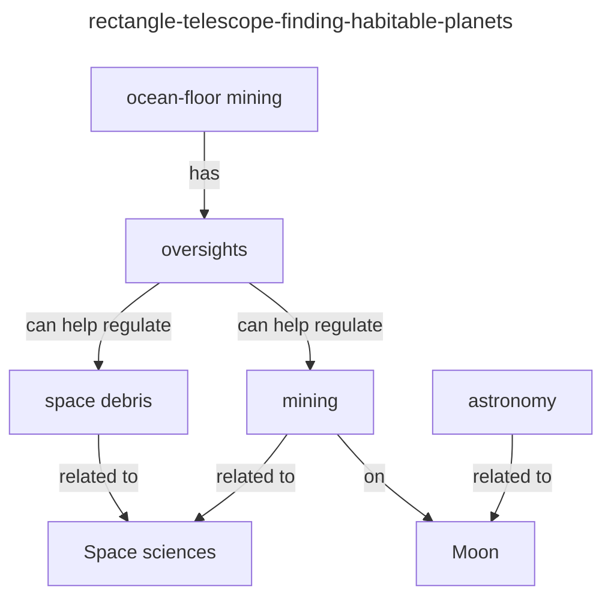

```mermaid
---
title: rectangle-telescope-finding-habitable-planets
---
graph TD
    ocean_floor_mining["ocean-floor mining"] -- has --> oversights["oversights"]
    oversights["oversights"] -- can help regulate --> space_debris["space debris"]
    oversights["oversights"] -- can help regulate --> mining["mining"]
    mining["mining"] -- on --> moon["Moon"]
    space_debris["space debris"] -- related to --> space_sciences["Space sciences"]
    mining["mining"] -- related to --> space_sciences["Space sciences"]
    astronomy["astronomy"] -- related to --> moon["Moon"]
```
