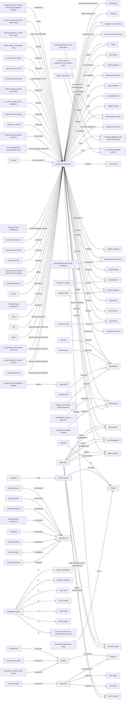

```mermaid
flowchart LR
    integrated_system_of_plant_and_animal_production_practices["integrated system of plant and animal production practices"] -->|is defined as| sustainable_agriculture["sustainable agriculture"]
    society's_present_food_and_textile_needs["society's present food and textile needs"] -->|meets| sustainable_agriculture["sustainable agriculture"]
    future_generations_to_meet_their_needs["future generations to meet their needs"] -->|does not compromise| sustainable_agriculture["sustainable agriculture"]
    sustainable_agriculture["sustainable agriculture"] -->|is based on| ecosystem_services["ecosystem services"]
    sustainable_agriculture["sustainable agriculture"] -->|includes| permaculture["permaculture"]
    sustainable_agriculture["sustainable agriculture"] -->|includes| agroforestry["agroforestry"]
    sustainable_agriculture["sustainable agriculture"] -->|includes| mixed_farming["mixed farming"]
    sustainable_agriculture["sustainable agriculture"] -->|includes| multiple_cropping["multiple cropping"]
    sustainable_agriculture["sustainable agriculture"] -->|includes| crop_rotation["crop rotation"]
    sustainable_agriculture["sustainable agriculture"] -->|includes| land_sparing["land sparing"]
    sustainable_agriculture["sustainable agriculture"] -->|contributes to| sustainable_food_systems["sustainable food systems"]
    sustainability_of_the_human_population["sustainability of the human population"] -->|contribute to| sustainable_food_systems["sustainable food systems"]
    sustainable_agriculture["sustainable agriculture"] -->|mitigates| climate_change["climate change"]
    sustainable_agriculture["sustainable agriculture"] -->|provides solution for| global_food_security["global food security"]
    dietary_shifts_to_sustainable_diets["dietary shifts to sustainable diets"] -->|involves| sustainable_agriculture["sustainable agriculture"]
    sustainable_agriculture["sustainable agriculture"] -->|prevents| soil_erosion["soil erosion"]
    sustainable_agriculture["sustainable agriculture"] -->|prevents| water_pollution["water pollution"]
    sustainable_agriculture["sustainable agriculture"] -->|prevents| land_degradation["land degradation"]
    sustainable_agriculture["sustainable agriculture"] -->|prevents| deforestation["deforestation"]
    sustainable_agriculture["sustainable agriculture"] -->|prevents| nutrient_depletion["nutrient depletion"]
    sustainable_agriculture["sustainable agriculture"] -->|prevents| eutrophication["eutrophication"]
    sustainable_agriculture["sustainable agriculture"] -->|uses| nutrient_cycling["nutrient cycling"]
    sustainable_agriculture["sustainable agriculture"] -->|uses| soil_regeneration["soil regeneration"]
    sustainable_agriculture["sustainable agriculture"] -->|uses| nitrogen_fixation["nitrogen fixation"]
    sustainable_agriculture["sustainable agriculture"] -->|uses| AI_controlled_irrigation_systems["AI-controlled irrigation systems"]
    sustainable_agriculture["sustainable agriculture"] -->|uses| Artificial_intelligence_AI_mobile_soil_analysis["Artificial intelligence (AI) mobile soil analysis"]
    sustainable_agriculture["sustainable agriculture"] -->|uses| Agrivoltaics["Agrivoltaics"]
    sustainable_agriculture["sustainable agriculture"] -->|is connected to| planetary_boundaries["planetary boundaries"]
    sustainable_agriculture["sustainable agriculture"] -->|is connected to| carrying_capacity["carrying capacity"]
    sustainable_agriculture["sustainable agriculture"] -->|is defined by| USDA["USDA"]
    USDA["USDA"] -->|defined| sustainable_agriculture["sustainable agriculture"]
    environmental_quality["environmental quality"] -->|enhances| sustainable_agriculture["sustainable agriculture"]
    natural_resource_base["natural resource base"] -->|enhances| sustainable_agriculture["sustainable agriculture"]
    nonrenewable_resources["nonrenewable resources"] -->|makes efficient use of| sustainable_agriculture["sustainable agriculture"]
    natural_biological_cycles_and_controls["natural biological cycles and controls"] -->|integrates| sustainable_agriculture["sustainable agriculture"]
    economic_viability_of_farm_operations["economic viability of farm operations"] -->|sustains| sustainable_agriculture["sustainable agriculture"]
    quality_of_life_for_farmers["quality of life for farmers"] -->|enhances| sustainable_agriculture["sustainable agriculture"]
    society_as_a_whole["society as a whole"] -->|enhances| sustainable_agriculture["sustainable agriculture"]
    sustainable_agriculture["sustainable agriculture"] -->|is prevalent in| indigenous_communities["indigenous communities"]
    indigenous_communities["indigenous communities"] -->|have practiced| sustainable_agriculture["sustainable agriculture"]
    sustainable_agriculture["sustainable agriculture"] -->|is considered| reconciliation_ecology["reconciliation ecology"]
    biodiversity_within_human_landscapes["biodiversity within human landscapes"] -->|accommodates| reconciliation_ecology["reconciliation ecology"]
    biological_and_ecological_processes["biological and ecological processes"] -->|incorporates| sustainable_agriculture["sustainable agriculture"]
    non_renewable_and_unsustainable_inputs["non-renewable and unsustainable inputs"] -->|uses decreased amounts of| sustainable_agriculture["sustainable agriculture"]
    farmers["farmers"] -->|uses expertise of| sustainable_agriculture["sustainable agriculture"]
    cooperation_and_collaboration["cooperation and collaboration"] -->|solves problems through| sustainable_agriculture["sustainable agriculture"]
    long_term_economics["long-term economics"] -->|considers| sustainable_agriculture["sustainable agriculture"]
    resource_conservation["resource conservation"] -->|balances| sustainable_agriculture["sustainable agriculture"]
    needs_of_farmers["needs of farmers"] -->|balances| sustainable_agriculture["sustainable agriculture"]
    sustainable_agriculture["sustainable agriculture"] -->|adopts| technology["technology"]
    environmentally_focused_appropriate_technology["environmentally-focused appropriate technology"] -->|adopts| sustainable_agriculture["sustainable agriculture"]
    water_consumption["water consumption"] -->|optimize| AI_controlled_irrigation_systems["AI-controlled irrigation systems"]
    on_site,_real_time_evaluations_of_soil_nutrient_levels["on-site, real-time evaluations of soil nutrient levels"] -->|enables| Artificial_intelligence_AI_mobile_soil_analysis["Artificial intelligence (AI) mobile soil analysis"]
    land_use["land use"] -->|optimizes| Agrivoltaics["Agrivoltaics"]
    clean_energy["clean energy"] -->|generates| Agrivoltaics["Agrivoltaics"]
    microclimates["microclimates"] -->|improves| Agrivoltaics["Agrivoltaics"]
    resilient,_eco_friendly_farming_practices["resilient, eco-friendly farming practices"] -->|promotes| Agrivoltaics["Agrivoltaics"]
    excessive_tilling["excessive tilling"] -->|causes| soil_erosion["soil erosion"]
    irrigation_without_adequate_drainage["irrigation without adequate drainage"] -->|causes| salinization["salinization"]
    reduced_yields["reduced yields"] -->|leads to| nutrient_depletion["nutrient depletion"]
    replenishing_the_soil["replenishing the soil"] -->|depends on| sustainable_agriculture["sustainable agriculture"]
    sustainable_agriculture["sustainable agriculture"] -->|minimizes use of| non_renewable_resources["non-renewable resources"]
    fertilizer_or_manure["fertilizer or manure"] -->|causes| eutrophication["eutrophication"]
    nitrates["nitrates"] -->|are used as| fertilizer["fertilizer"]
    environment["environment"] -->|leach into| nitrates["nitrates"]
    recycling_crop_waste["recycling crop waste"] -->|is source of| nitrates["nitrates"]
    livestock_or_treated_human_manure["livestock or treated human manure"] -->|is source of| nitrates["nitrates"]
    rhizobia["rhizobia"] -->|fix| nitrogen["nitrogen"]
    Haber_process["Haber process"] -->|produces| nitrogen["nitrogen"]
    hydrogen["hydrogen"] -->|uses| Haber_process["Haber process"]
    genetically_engineering_crops["genetically engineering crops"] -->|can fix| nitrogen["nitrogen"]
    phosphate["phosphate"] -->|is component in| fertilizer["fertilizer"]
    phosphate["phosphate"] -->|improves| soil_fertility["soil fertility"]
    phosphate["phosphate"] -->|improves| crop_yields["crop yields"]
    photosynthesis["photosynthesis"] -->|is involved in| phosphorus["phosphorus"]
    energy_transfer["energy transfer"] -->|is involved in| phosphorus["phosphorus"]
    signal_transduction["signal transduction"] -->|is involved in| phosphorus["phosphorus"]
    macromolecular_biosynthesis["macromolecular biosynthesis"] -->|is involved in| phosphorus["phosphorus"]
    respiration["respiration"] -->|is involved in| phosphorus["phosphorus"]
    root_ramification["root ramification"] -->|is needed for| phosphorus["phosphorus"]
    seed_formation["seed formation"] -->|is needed for| phosphorus["phosphorus"]
    disease_resistance["disease resistance"] -->|increases| phosphorus["phosphorus"]
    rock_phosphate["rock phosphate"] -->|is source of| phosphate["phosphate"]
    biochar["biochar"] -->|is used in| sustainable_agriculture["sustainable agriculture"]
    certification_system["certification system"] -->|is| organic_certification["organic certification"]
    certification_system["certification system"] -->|is| Rainforest_Alliance["Rainforest Alliance"]
    certification_system["certification system"] -->|is| Fair_Trade["Fair Trade"]
    certification_system["certification system"] -->|is| UTZ_Certified["UTZ Certified"]
    certification_system["certification system"] -->|is| GlobalGAP["GlobalGAP"]
    certification_system["certification system"] -->|is| Bird_Friendly["Bird Friendly"]
    certification_system["certification system"] -->|is| Common_Code_for_the_Coffee_Community_4C["Common Code for the Coffee Community (4C)"]
    AI_research_and_development["AI research and development"] -->|is field for| sustainable_agriculture["sustainable agriculture"]
    agriculture["agriculture"] -->|plays significant role in| climate_change["climate change"]
    agriculture["agriculture"] -->|causes| water_scarcity["water scarcity"]
    agriculture["agriculture"] -->|causes| water_pollution["water pollution"]
    agriculture["agriculture"] -->|causes| land_degradation["land degradation"]
    agriculture["agriculture"] -->|causes| deforestation["deforestation"]
    agriculture["agriculture"] -->|is impacted by| climate_change["climate change"]
    agriculture["agriculture"] -->|is impacted by| water_scarcity["water scarcity"]
    agriculture["agriculture"] -->|is impacted by| water_pollution["water pollution"]
    agriculture["agriculture"] -->|is impacted by| land_degradation["land degradation"]
    agriculture["agriculture"] -->|is impacted by| deforestation["deforestation"]
    crops["crops"] -->|allows production of| sustainable_agriculture["sustainable agriculture"]
    sustainable_agriculture["sustainable agriculture"] -->|allows production of| livestock["livestock"]
    soil["soil"] -->|prevents adverse effects on| sustainable_agriculture["sustainable agriculture"]
    water["water"] -->|prevents adverse effects on| sustainable_agriculture["sustainable agriculture"]
    sustainable_agriculture["sustainable agriculture"] -->|prevents adverse effects on| biodiversity["biodiversity"]
    surrounding_or_downstream_resources["surrounding or downstream resources"] -->|prevents adverse effects on| sustainable_agriculture["sustainable agriculture"]
    those_working_or_living_on_the_farm["those working or living on the farm"] -->|prevents adverse effects on| sustainable_agriculture["sustainable agriculture"]
    neighboring_areas["neighboring areas"] -->|prevents adverse effects on| sustainable_agriculture["sustainable agriculture"]
    conventional_intensive_agriculture["conventional intensive agriculture"] -->|combines| land_sparing["land sparing"]
    protection_of_natural_habitats["protection of natural habitats"] -->|combines| land_sparing["land sparing"]
    sustainable_agriculture["sustainable agriculture"] -->|can be considered| land_sparing["land sparing"]
```
