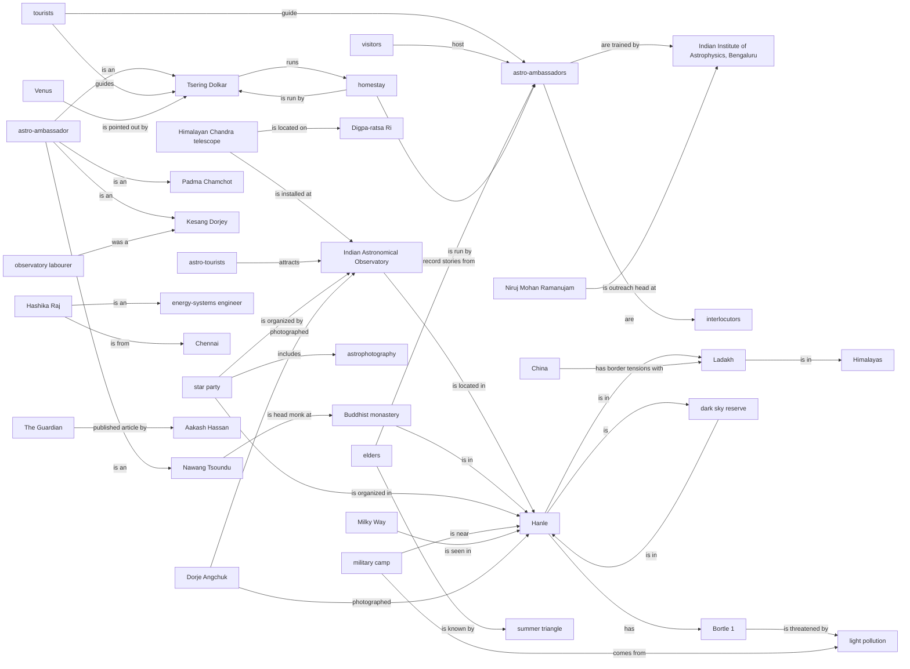

```mermaid
flowchart LR
    astro_ambassador["astro-ambassador"] -->|is an| Tsering_Dolkar["Tsering Dolkar"]
    tourists["tourists"] -->|guides| Tsering_Dolkar["Tsering Dolkar"]
    Tsering_Dolkar["Tsering Dolkar"] -->|runs| homestay["homestay"]
    astro_ambassadors["astro-ambassadors"] -->|are trained by| Indian_Institute_of_Astrophysics,_Bengaluru["Indian Institute of Astrophysics, Bengaluru"]
    tourists["tourists"] -->|guide| astro_ambassadors["astro-ambassadors"]
    visitors["visitors"] -->|host| astro_ambassadors["astro-ambassadors"]
    astro_ambassadors["astro-ambassadors"] -->|are| interlocutors["interlocutors"]
    Niruj_Mohan_Ramanujam["Niruj Mohan Ramanujam"] -->|is outreach head at| Indian_Institute_of_Astrophysics,_Bengaluru["Indian Institute of Astrophysics, Bengaluru"]
    Indian_Astronomical_Observatory["Indian Astronomical Observatory"] -->|is located in| Hanle["Hanle"]
    Hanle["Hanle"] -->|is in| Ladakh["Ladakh"]
    Ladakh["Ladakh"] -->|is in| Himalayas["Himalayas"]
    Hanle["Hanle"] -->|is| dark_sky_reserve["dark sky reserve"]
    dark_sky_reserve["dark sky reserve"] -->|is in| Hanle["Hanle"]
    Himalayan_Chandra_telescope["Himalayan Chandra telescope"] -->|is installed at| Indian_Astronomical_Observatory["Indian Astronomical Observatory"]
    Himalayan_Chandra_telescope["Himalayan Chandra telescope"] -->|is located on| Digpa_ratsa_Ri["Digpa-ratsa Ri"]
    astro_tourists["astro-tourists"] -->|attracts| Indian_Astronomical_Observatory["Indian Astronomical Observatory"]
    astro_ambassador["astro-ambassador"] -->|is an| Padma_Chamchot["Padma Chamchot"]
    astro_ambassador["astro-ambassador"] -->|is an| Kesang_Dorjey["Kesang Dorjey"]
    observatory_labourer["observatory labourer"] -->|was a| Kesang_Dorjey["Kesang Dorjey"]
    astro_ambassador["astro-ambassador"] -->|is an| Nawang_Tsoundu["Nawang Tsoundu"]
    Nawang_Tsoundu["Nawang Tsoundu"] -->|is head monk at| Buddhist_monastery["Buddhist monastery"]
    Buddhist_monastery["Buddhist monastery"] -->|is in| Hanle["Hanle"]
    Hashika_Raj["Hashika Raj"] -->|is an| energy_systems_engineer["energy-systems engineer"]
    Hashika_Raj["Hashika Raj"] -->|is from| Chennai["Chennai"]
    star_party["star party"] -->|is organized in| Hanle["Hanle"]
    star_party["star party"] -->|is organized by| Indian_Astronomical_Observatory["Indian Astronomical Observatory"]
    star_party["star party"] -->|includes| astrophotography["astrophotography"]
    Hanle["Hanle"] -->|has| Bortle_1["Bortle 1"]
    Bortle_1["Bortle 1"] -->|is threatened by| light_pollution["light pollution"]
    military_camp["military camp"] -->|comes from| light_pollution["light pollution"]
    military_camp["military camp"] -->|is near| Hanle["Hanle"]
    China["China"] -->|has border tensions with| Ladakh["Ladakh"]
    elders["elders"] -->|record stories from| astro_ambassadors["astro-ambassadors"]
    elders["elders"] -->|is known by| summer_triangle["summer triangle"]
    Venus["Venus"] -->|is pointed out by| Tsering_Dolkar["Tsering Dolkar"]
    Milky_Way["Milky Way"] -->|is seen in| Hanle["Hanle"]
    homestay["homestay"] -->|is run by| Tsering_Dolkar["Tsering Dolkar"]
    homestay["homestay"] -->|is run by| astro_ambassadors["astro-ambassadors"]
    The_Guardian["The Guardian"] -->|published article by| Aakash_Hassan["Aakash Hassan"]
    Dorje_Angchuk["Dorje Angchuk"] -->|photographed| Indian_Astronomical_Observatory["Indian Astronomical Observatory"]
    Dorje_Angchuk["Dorje Angchuk"] -->|photographed| Hanle["Hanle"]
```
