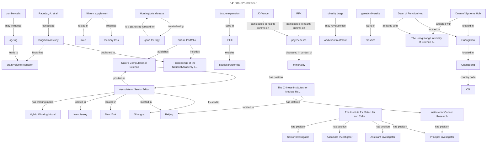

```mermaid
---
title: d41586-025-03353-5
---
graph TD
    ageing["ageing"] -- leads to --> brain_volume_reduction["brain volume reduction"]
    longitudinal_study["longitudinal study"] -- published in --> proceedings_of_the_national_academy_of_sciences["Proceedings of the National Academy o..."]
    longitudinal_study["longitudinal study"] -- finds that --> brain_volume_reduction["brain volume reduction"]
    ravndal_a_et_al["Ravndal, A. et al."] -- conducted --> longitudinal_study["longitudinal study"]
    lithium_supplement["lithium supplement"] -- reverses --> memory_loss["memory loss"]
    lithium_supplement["lithium supplement"] -- tested in --> mice["mice"]
    huntington_s_disease["Huntington’s disease"] -- treated using --> gene_therapy["gene therapy"]
    gene_therapy["gene therapy"] -- is a giant step forward for --> huntington_s_disease["Huntington’s disease"]
    zombie_cells["zombie cells"] -- may influence --> ageing["ageing"]
    nature_portfolio["Nature Portfolio"] -- includes --> proceedings_of_the_national_academy_of_sciences["Proceedings of the National Academy o..."]
    ipex["iPEX"] -- enables --> spatial_proteomics["spatial proteomics"]
    tissue_expansion["tissue expansion"] -- used in --> ipex["iPEX"]
    psychedelics["psychedelics"] -- discussed in context of --> immortality["immortality"]
    obesity_drugs["obesity drugs"] -- may revolutionize --> addiction_treatment["addiction treatment"]
    rfk["RFK"] -- participated in health summit on --> psychedelics["psychedelics"]
    jd_vance["JD Vance"] -- participated in health summit on --> psychedelics["psychedelics"]
    genetic_diversity["genetic diversity"] -- found in --> mosaics["mosaics"]
    associate_or_senior_editor["Associate or Senior Editor"] -- position at --> nature_computational_science["Nature Computational Science"]
    nature_computational_science["Nature Computational Science"] -- has position --> associate_or_senior_editor["Associate or Senior Editor"]
    associate_or_senior_editor["Associate or Senior Editor"] -- located in --> shanghai["Shanghai"]
    associate_or_senior_editor["Associate or Senior Editor"] -- located in --> beijing["Beijing"]
    associate_or_senior_editor["Associate or Senior Editor"] -- located in --> new_york["New York"]
    associate_or_senior_editor["Associate or Senior Editor"] -- located in --> new_jersey["New Jersey"]
    associate_or_senior_editor["Associate or Senior Editor"] -- has working model --> hybrid_working_model["Hybrid Working Model"]
    nature_portfolio["Nature Portfolio"] -- publishes --> nature_computational_science["Nature Computational Science"]
    the_institute_for_molecular_and_cellular_therapeutics["The Institute for Molecular and Cellu..."] -- has position --> principal_investigator["Principal Investigator"]
    the_institute_for_molecular_and_cellular_therapeutics["The Institute for Molecular and Cellu..."] -- has position --> assistant_investigator["Assistant Investigator"]
    the_institute_for_molecular_and_cellular_therapeutics["The Institute for Molecular and Cellu..."] -- has position --> associate_investigator["Associate Investigator"]
    the_institute_for_molecular_and_cellular_therapeutics["The Institute for Molecular and Cellu..."] -- has position --> senior_investigator["Senior Investigator"]
    the_chinese_institutes_for_medical_research["The Chinese Institutes for Medical Re..."] -- located in --> beijing["Beijing"]
    the_chinese_institutes_for_medical_research["The Chinese Institutes for Medical Re..."] -- has institute --> institute_for_cancer_research["Institute for Cancer Research"]
    institute_for_cancer_research["Institute for Cancer Research"] -- has position --> principal_investigator["Principal Investigator"]
    dean_of_systems_hub["Dean of Systems Hub"] -- located in --> guangzhou["Guangzhou"]
    guangzhou["Guangzhou"] -- located in --> guangdong["Guangdong"]
    guangdong["Guangdong"] -- country code --> cn["CN"]
    dean_of_systems_hub["Dean of Systems Hub"] -- affiliated with --> the_hong_kong_university_of_science_and_technology_guangzhou["The Hong Kong University of Science a..."]
    dean_of_function_hub["Dean of Function Hub"] -- located in --> guangzhou["Guangzhou"]
    dean_of_function_hub["Dean of Function Hub"] -- affiliated with --> the_hong_kong_university_of_science_and_technology_guangzhou["The Hong Kong University of Science a..."]
```
