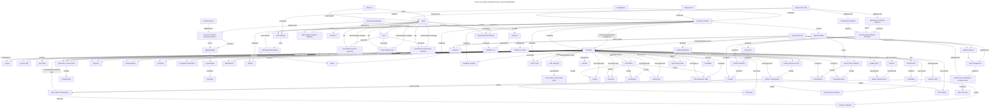

```mermaid
---
title: time-reconsider-tramadol-chronic-pain-2025a1000ria
---
graph TD
    tramadol["Tramadol"] -- is a --> opioid["opioid"]
    tramadol["Tramadol"] -- used for --> chronic_pain["chronic pain"]
    tramadol["Tramadol"] -- provides --> pain_relief["pain relief"]
    tramadol["Tramadol"] -- increases risk of --> side_effects["side effects"]
    tramadol["Tramadol"] -- increases risk of --> serious_adverse_events["serious adverse events"]
    serious_adverse_events["serious adverse events"] -- include --> cardiac_complications["cardiac complications"]
    tramadol["Tramadol"] -- modulates --> serotonin["serotonin"]
    tramadol["Tramadol"] -- modulates --> norepinephrine["norepinephrine"]
    tramadol["Tramadol"] -- is less addictive than --> morphine["morphine"]
    tramadol["Tramadol"] -- is stronger than --> nonopioid_medications["nonopioid medications"]
    tramadol["Tramadol"] -- is approved for --> moderate_to_severe_pain["moderate-to-severe pain"]
    moderate_to_severe_pain["moderate-to-severe pain"] -- includes --> postoperative["postoperative"]
    tramadol["Tramadol"] -- associated with --> dependence["dependence"]
    global_analysis["global analysis"] -- estimated lifetime use of --> tramadol["Tramadol"]
    investigators["investigators"] -- conducted --> systematic_review["systematic review"]
    investigators["investigators"] -- conducted --> meta_analysis["meta-analysis"]
    systematic_review["systematic review"] -- evaluated --> efficacy["efficacy"]
    systematic_review["systematic review"] -- evaluated --> safety["safety"]
    meta_analysis["meta-analysis"] -- used --> trial_sequential_analysis["trial sequential analysis"]
    tramadol["Tramadol"] -- has limited --> analgesic_benefits["analgesic benefits"]
    tramadol["Tramadol"] -- increases --> risk_of_harm["risk of harm"]
    jehad_ahmad_barakji["Jehad Ahmad Barakji"] -- affiliated with --> centre_for_clinical_intervention_research["Centre for Clinical Intervention Rese..."]
    centre_for_clinical_intervention_research["Centre for Clinical Intervention Rese..."] -- located in --> rigshospitalet["Rigshospitalet"]
    rigshospitalet["Rigshospitalet"] -- located in --> copenhagen["Copenhagen"]
    copenhagen["Copenhagen"] -- located in --> denmark["Denmark"]
    jehad_ahmad_barakji["Jehad Ahmad Barakji"] -- quoted by --> medscape_medical_news["Medscape Medical News"]
    study["study"] -- published in --> bmj_evidence_based_medicine["BMJ Evidence-Based Medicine"]
    study["study"] -- published on --> october_7["October 7"]
    systematic_review["systematic review"] -- is first comprehensive evaluation of --> tramadol["Tramadol"]
    systematic_review["systematic review"] -- evaluated --> tramadol["Tramadol"]
    tramadol["Tramadol"] -- compared to --> placebo["placebo"]
    tramadol["Tramadol"] -- resulted in small --> pain_reduction["pain reduction"]
    pain_reduction["pain reduction"] -- measured by --> n_0_10_numeric_rating_scale_nrs["0-10 numeric rating scale NRS"]
    tramadol["Tramadol"] -- did not improve --> function["function"]
    tramadol["Tramadol"] -- did not improve --> quality_of_life["quality of life"]
    tramadol["Tramadol"] -- associated with --> nausea["nausea"]
    tramadol["Tramadol"] -- associated with --> dizziness["dizziness"]
    tramadol["Tramadol"] -- associated with --> constipation["constipation"]
    tramadol["Tramadol"] -- associated with --> drowsiness["drowsiness"]
    tramadol["Tramadol"] -- increased --> discontinuation_rates["discontinuation rates"]
    study["study"] -- had limitations including --> bias["bias"]
    study["study"] -- had limitations including --> incomplete_outcome_reporting["incomplete outcome reporting"]
    study["study"] -- had limitations including --> small_sample_sizes["small sample sizes"]
    study["study"] -- had limitations including --> inconsistent_assessment_methods["inconsistent assessment methods"]
    tramadol["Tramadol"] -- used across --> chronic_pain_conditions["chronic pain conditions"]
    jessica_otte_md["Jessica Otte, MD"] -- affiliated with --> department_of_family_medicine["Department of Family Medicine"]
    department_of_family_medicine["Department of Family Medicine"] -- located at --> the_university_of_british_columbia["The University of British Columbia"]
    the_university_of_british_columbia["The University of British Columbia"] -- located in --> vancouver["Vancouver"]
    vancouver["Vancouver"] -- located in --> british_columbia["British Columbia"]
    british_columbia["British Columbia"] -- located in --> canada["Canada"]
    jessica_otte_md["Jessica Otte, MD"] -- affiliated with --> therapeutics_initiative["Therapeutics Initiative"]
    danish_team["Danish team"] -- conducted --> systematic_review["systematic review"]
    tramadol["Tramadol"] -- has unclear --> risk_benefit_profile["risk-benefit profile"]
    tramadol["Tramadol"] -- associated with --> cardiac_events["cardiac events"]
    cardiac_events["cardiac events"] -- include --> heart_rhythm_disturbances["heart rhythm disturbances"]
    cardiac_events["cardiac events"] -- include --> cardiac_conduction["cardiac conduction"]
    tramadol["Tramadol"] -- may cause --> chest_pain["chest pain"]
    tramadol["Tramadol"] -- may worsen --> coronary_artery_disease["coronary artery disease"]
    tramadol["Tramadol"] -- may worsen --> heart_failure["heart failure"]
    houman_danesh["Houman Danesh"] -- is --> professor["professor"]
    houman_danesh["Houman Danesh"] -- is --> medical_director["medical director"]
    houman_danesh["Houman Danesh"] -- affiliated with --> pain_management["pain management"]
    pain_management["pain management"] -- located at --> icahn_school_of_medicine_at_mount_sinai["Icahn School of Medicine at Mount Sinai"]
    icahn_school_of_medicine_at_mount_sinai["Icahn School of Medicine at Mount Sinai"] -- located in --> new_york_city["New York City"]
    evidence["evidence"] -- published by --> webmd_llc["WebMD, LLC"]
    evidence["evidence"] -- published on --> october_13_2025["October 13, 2025"]
    tramadol["Tramadol"] -- is classified as --> opioid["opioid"]
    tramadol["Tramadol"] -- has --> side_effects["side effects"]
    tramadol["Tramadol"] -- associated with --> serious_adverse_events["serious adverse events"]
    cardiac_complications["cardiac complications"] -- include --> chest_pain["chest pain"]
    cardiac_complications["cardiac complications"] -- include --> coronary_artery_disease["coronary artery disease"]
    cardiac_complications["cardiac complications"] -- include --> heart_failure["heart failure"]
    side_effects["side effects"] -- include --> nausea["nausea"]
    side_effects["side effects"] -- include --> dizziness["dizziness"]
    side_effects["side effects"] -- include --> constipation["constipation"]
    side_effects["side effects"] -- include --> drowsiness["drowsiness"]
    side_effects["side effects"] -- lead to --> discontinuation_rates["discontinuation rates"]
    discontinuation_rates["discontinuation rates"] -- are higher in --> tramadol["Tramadol"]
    systematic_review["systematic review"] -- includes --> meta_analysis["meta-analysis"]
    systematic_review["systematic review"] -- evaluates --> analgesic_benefits["analgesic benefits"]
    systematic_review["systematic review"] -- assesses --> risk_of_harm["risk of harm"]
    systematic_review["systematic review"] -- involves --> global_analysis["global analysis"]
    global_analysis["global analysis"] -- covers --> chronic_pain_conditions["chronic pain conditions"]
    chronic_pain_conditions["chronic pain conditions"] -- include --> osteoarthritis["osteoarthritis"]
    chronic_pain_conditions["chronic pain conditions"] -- include --> neuropathic_pain["neuropathic pain"]
    tramadol["Tramadol"] -- results in --> pain_reduction["pain reduction"]
    function["function"] -- measured by --> patient_reported_tools["patient-reported tools"]
    quality_of_life["quality of life"] -- measured by --> patient_reported_tools["patient-reported tools"]
    study["study"] -- has limitation --> bias["bias"]
    bias["bias"] -- caused by --> incomplete_outcome_reporting["incomplete outcome reporting"]
    bias["bias"] -- caused by --> small_sample_sizes["small sample sizes"]
    bias["bias"] -- caused by --> inconsistent_assessment_methods["inconsistent assessment methods"]
    department_of_family_medicine["Department of Family Medicine"] -- part of --> the_university_of_british_columbia["The University of British Columbia"]
    therapeutics_initiative["Therapeutics Initiative"] -- based at --> the_university_of_british_columbia["The University of British Columbia"]
    jessica_otte_md["Jessica Otte, MD"] -- comments on --> systematic_review["systematic review"]
    systematic_review["systematic review"] -- published in --> bmj_evidence_based_medicine["BMJ Evidence-Based Medicine"]
    systematic_review["systematic review"] -- covered by --> medscape_medical_news["Medscape Medical News"]
    tramadol["Tramadol"] -- has mechanism involving --> serotonin["serotonin"]
    tramadol["Tramadol"] -- has mechanism involving --> norepinephrine["norepinephrine"]
    tramadol["Tramadol"] -- compared to --> morphine["morphine"]
    tramadol["Tramadol"] -- compared to --> nonopioid_medications["nonopioid medications"]
    tramadol["Tramadol"] -- used for --> moderate_to_severe_pain["moderate-to-severe pain"]
    tramadol["Tramadol"] -- has risk of --> dependence["dependence"]
    systematic_review["systematic review"] -- uses method --> trial_sequential_analysis["trial sequential analysis"]
    trial_sequential_analysis["trial sequential analysis"] -- assesses --> efficacy["efficacy"]
    trial_sequential_analysis["trial sequential analysis"] -- assesses --> safety["safety"]
    tramadol["Tramadol"] -- has poor --> tolerability["tolerability"]
    tramadol["Tramadol"] -- has --> attrition_bias["attrition bias"]
    attrition_bias["attrition bias"] -- related to --> withdrawal["withdrawal"]
    houman_danesh["Houman Danesh"] -- affiliated with --> icahn_school_of_medicine_at_mount_sinai["Icahn School of Medicine at Mount Sinai"]
    houman_danesh["Houman Danesh"] -- identifies --> confounding_factor["confounding factor"]
    confounding_factor["confounding factor"] -- affects --> risk_benefit_profile["risk-benefit profile"]
    heart_rhythm_disturbances["heart rhythm disturbances"] -- related to --> cardiac_conduction["cardiac conduction"]
    clinicians["clinicians"] -- rely on --> study["study"]
    study["study"] -- provides --> evidence["evidence"]
    jessica_otte_md["Jessica Otte, MD"] -- believes --> study["study"]
    tramadol["Tramadol"] -- increases risk for --> serious_adverse_events["serious adverse events"]
    heart_rhythm_disturbances["heart rhythm disturbances"] -- occasionally associated with --> tramadol["Tramadol"]
    clinicians["clinicians"] -- should weigh --> study["study"]
    the_university_of_british_columbia["The University of British Columbia"] -- located in --> british_columbia["British Columbia"]
    the_university_of_british_columbia["The University of British Columbia"] -- located in --> canada["Canada"]
    houman_danesh["Houman Danesh"] -- holds position --> professor["professor"]
    houman_danesh["Houman Danesh"] -- holds position --> medical_director["medical director"]
    medical_director["medical director"] -- of --> pain_management["pain management"]
    danish_authors["Danish authors"] -- affiliated with --> centre_for_clinical_intervention_research["Centre for Clinical Intervention Rese..."]
    centre_for_clinical_intervention_research["Centre for Clinical Intervention Rese..."] -- part of --> rigshospitalet["Rigshospitalet"]
    study["study"] -- covered by --> medscape_medical_news["Medscape Medical News"]
    medscape_medical_news["Medscape Medical News"] -- owned by --> webmd_llc["WebMD, LLC"]
    study["study"] -- has --> incomplete_outcome_reporting["incomplete outcome reporting"]
    study["study"] -- has --> small_sample_sizes["small sample sizes"]
    study["study"] -- has --> inconsistent_assessment_methods["inconsistent assessment methods"]
    tramadol["Tramadol"] -- associated with --> cardiac_complications["cardiac complications"]
    cardiac_complications["cardiac complications"] -- include --> heart_rhythm_disturbances["heart rhythm disturbances"]
    tramadol["Tramadol"] -- affects --> serotonin["serotonin"]
    tramadol["Tramadol"] -- affects --> norepinephrine["norepinephrine"]
    tramadol["Tramadol"] -- is used for --> moderate_to_severe_pain["moderate-to-severe pain"]
    tramadol["Tramadol"] -- is used for --> chronic_pain["chronic pain"]
    tramadol["Tramadol"] -- is used for --> osteoarthritis["osteoarthritis"]
    tramadol["Tramadol"] -- is used for --> neuropathic_pain["neuropathic pain"]
```
