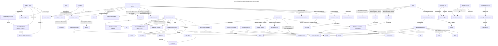

```mermaid
---
title: second-dose-boosts-shingles-protection-adults-aged
---
graph TD
    recombinant_herpes_zoster_vaccine["recombinant herpes zoster vaccine"] -- is effective in --> older_adults["older adults"]
    recombinant_herpes_zoster_vaccine["recombinant herpes zoster vaccine"] -- is effective regardless of --> immunocompromised_status["immunocompromised status"]
    cdc["CDC"] -- recommends --> two_dose_series["two-dose series"]
    nadja_a_vielot["Nadja A. Vielot"] -- is --> epidemiologist["epidemiologist"]
    nadja_a_vielot["Nadja A. Vielot"] -- affiliated with --> department_of_family_medicine["Department of Family Medicine"]
    department_of_family_medicine["Department of Family Medicine"] -- part of --> university_of_north_carolina_school_of_medicine["University of North Carolina School o..."]
    university_of_north_carolina_school_of_medicine["University of North Carolina School o..."] -- located in --> chapel_hill_north_carolina["Chapel Hill, North Carolina"]
    medicare_fee_for_service["Medicare fee-for-service"] -- enrolled between --> n_2007_2019["2007-2019"]
    vaccine_effectiveness["vaccine effectiveness"] -- measured as --> n_56_1["56.1%"]
    recombinant_herpes_zoster_vaccine["recombinant herpes zoster vaccine"] -- also known as --> rzv["RZV"]
    vaccine_effectiveness["vaccine effectiveness"] -- measured as --> ve["VE"]
    n_1_year_effectiveness["1-year effectiveness"] -- was --> n_56_1["56.1%"]
    vaccine_effectiveness["vaccine effectiveness"] -- in immunocompromised --> n_54_2["54.2%"]
    vaccine_effectiveness["vaccine effectiveness"] -- in immunocompetent --> n_56_5["56.5%"]
    disparities_in_vaccine_effectiveness["disparities in vaccine effectiveness"] -- observed in --> racial_groups["racial groups"]
    vaccine_effectiveness["vaccine effectiveness"] -- in Black individuals --> n_20["20%"]
    vaccine_effectiveness["vaccine effectiveness"] -- in non-Black individuals --> n_55["55%"]
    vaccine_effectiveness["vaccine effectiveness"] -- in Hispanic individuals --> n_55["55%"]
    race["race"] -- is a factor in --> disparities_in_vaccine_effectiveness["disparities in vaccine effectiveness"]
    ethnicity["ethnicity"] -- is a factor in --> disparities_in_vaccine_effectiveness["disparities in vaccine effectiveness"]
    private_insurance_claims["private insurance claims"] -- used to assess --> vaccine_effectiveness["vaccine effectiveness"]
    shingles_vaccine["shingles vaccine"] -- prevents --> shingles_infection["shingles infection"]
    shirin_mazumder["Shirin Mazumder"] -- is --> infectious_diseases_specialist["infectious diseases specialist"]
    shirin_mazumder["Shirin Mazumder"] -- is --> associate_professor["associate professor"]
    shirin_mazumder["Shirin Mazumder"] -- affiliated with --> university_of_tennessee_health_science_center["University of Tennessee Health Scienc..."]
    mazumder["Mazumder"] -- discussed --> barriers_to_vaccination["barriers to vaccination"]
    barriers_to_vaccination["barriers to vaccination"] -- include --> access["access"]
    barriers_to_vaccination["barriers to vaccination"] -- include --> insurance["insurance"]
    barriers_to_vaccination["barriers to vaccination"] -- include --> side_effects["side effects"]
    barriers_to_vaccination["barriers to vaccination"] -- include --> patient_hesitancy["patient hesitancy"]
    vaccine_programs["vaccine programs"] -- can reduce --> financial_burdens["financial burdens"]
    catherine_lane["Catherine Lane"] -- affiliated with --> getty_images["Getty Images"]
    news_medscape_net["news@medscape.net"] -- affiliated with --> medscape_medical_news["Medscape Medical News"]
    recombinant_herpes_zoster_vaccine["recombinant herpes zoster vaccine"] -- has two-dose series --> two_dose_series["two-dose series"]
    recombinant_herpes_zoster_vaccine["recombinant herpes zoster vaccine"] -- has vaccine effectiveness VE against ... --> n_67_9["67.9%"]
    two_dose_series["two-dose series"] -- has median time between doses --> n_4_5_months["4.5 months"]
    two_dose_series["two-dose series"] -- has sensitivity analysis effectiveness --> n_68_1["68.1%"]
    recombinant_herpes_zoster_vaccine["recombinant herpes zoster vaccine"] -- has lower VE in individuals aged --> n_85_years_or_older["85 years or older"]
    overall_study_population["overall study population"] -- has VE with one dose --> n_56_1["56.1%"]
    recombinant_herpes_zoster_vaccine["recombinant herpes zoster vaccine"] -- has similar VE in immunocompromised a... --> immunocompromised_status["immunocompromised status"]
    immunocompromised["immunocompromised"] -- has VE --> n_54_2["54.2%"]
    immunocompetent["immunocompetent"] -- has VE --> n_56_5["56.5%"]
    nadja_a_vielot["Nadja A. Vielot"] -- affiliated with --> university_of_north_carolina_school_of_medicine["University of North Carolina School o..."]
    nadja_a_vielot["Nadja A. Vielot"] -- located in --> chapel_hill_north_carolina["Chapel Hill, North Carolina"]
    nadja_a_vielot["Nadja A. Vielot"] -- is epidemiologist --> epidemiologist["epidemiologist"]
    vielot["Vielot"] -- says low background incidence of shin... --> black_individuals["Black individuals"]
    vielot["Vielot"] -- says vaccine recommendations should n... --> race["race"]
    vielot["Vielot"] -- says vaccine recommendations should n... --> ethnicity["ethnicity"]
    vielot["Vielot"] -- conducts analysis using --> private_insurance_claims["private insurance claims"]
    private_insurance_claims["private insurance claims"] -- used to assess --> safety["safety"]
    shingles_vaccine["shingles vaccine"] -- assessed for safety relative to --> shingles_infection["shingles infection"]
    shirin_mazumder["Shirin Mazumder"] -- is --> md["MD"]
    university_of_tennessee_health_science_center["University of Tennessee Health Scienc..."] -- located in --> memphis["Memphis"]
    memphis["Memphis"] -- located in --> tennessee["Tennessee"]
    shirin_mazumder["Shirin Mazumder"] -- comments on barriers to vaccination --> barriers_to_vaccination["barriers to vaccination"]
    mazumder["Mazumder"] -- suggests solutions including --> reminder_systems["reminder systems"]
    mazumder["Mazumder"] -- suggests solutions including --> vaccine_programs["vaccine programs"]
    vaccine_programs["vaccine programs"] -- reduce --> financial_burdens["financial burdens"]
    mazumder["Mazumder"] -- suggests open conversations about --> patient_hesitancy["patient hesitancy"]
    mazumder["Mazumder"] -- calls for research on --> disparities_in_vaccine_effectiveness["disparities in vaccine effectiveness"]
    disparities_in_vaccine_effectiveness["disparities in vaccine effectiveness"] -- related to --> racial_groups["racial groups"]
    shingles["shingles"] -- can be debilitating and painful --> older_adults["older adults"]
    shingles["shingles"] -- affects --> n_65_years_or_older["65 years or older"]
    recombinant_herpes_zoster_vaccine["recombinant herpes zoster vaccine"] -- assessed in study published in --> annals_of_internal_medicine["Annals of Internal Medicine"]
    recombinant_herpes_zoster_vaccine["recombinant herpes zoster vaccine"] -- studied using data from --> medicare_fee_for_service["Medicare fee-for-service"]
    medicare_fee_for_service["Medicare fee-for-service"] -- covers period --> n_2007_2019["2007-2019"]
    recombinant_herpes_zoster_vaccine["recombinant herpes zoster vaccine"] -- recommended for --> n_50_years_or_older["50 years or older"]
    recombinant_herpes_zoster_vaccine["recombinant herpes zoster vaccine"] -- compared to --> live_zoster_vaccine["live zoster vaccine"]
    shingles_vaccine["shingles vaccine"] -- may cause --> adverse_events["adverse events"]
    shirin_mazumder["Shirin Mazumder"] -- affiliation --> university_of_tennessee_health_science_center["University of Tennessee Health Scienc..."]
    shirin_mazumder["Shirin Mazumder"] -- title --> infectious_diseases_specialist["infectious diseases specialist"]
    shirin_mazumder["Shirin Mazumder"] -- title --> associate_professor["associate professor"]
    shirin_mazumder["Shirin Mazumder"] -- location --> memphis["Memphis"]
    shirin_mazumder["Shirin Mazumder"] -- location --> tennessee["Tennessee"]
    catherine_lane["Catherine Lane"] -- affiliation --> getty_images["Getty Images"]
    medscape_medical_news["Medscape Medical News"] -- copyright --> webmd_llc["WebMD, LLC"]
```
